Bereitstellung einer Single Page Application auf Azure Web Apps mit Web API und AngularJS und Nutzung von Azure AD zur Benutzerauthentifizierung
================================================================================================================================================

In klassischen Web Anwendungen initiiert der Client (Browser) die Kommunikation mit dem Server, indem er per Request eine Seite anfordert. Der Server verarbeitet diese Anfrage und schickt entsprechendes HTML zum Client zurück. In folgenden Interaktionen mit der Seite - der Anwender klickt beispielsweise auf einen Link oder schickt Formulareingaben an den Server - wird ein weiterer Request an den Server geschickt und die Abfolge startet von Neuem, d.h. der Server verarbeitet den Request und schickt eine zur Anfrage des Client entsprechende Seite zum Browser.

Bei Single-Page Anwendungen (SPAs) wird die gesamte Seite nach dem initialen Request in den Browser geladen. Folgende Interaktionen werden via Ajax Requests abgehandelt. Das bedeutet, dass der Browser nur die Teile einer Seite aktualisieren muss, die sich tatsächlich geändert haben; er muss also nicht die gesamte Seite laden. Der SPA Ansatz reduziert die Zeit, die für eine Reaktion auf Benutzer-Aktionen benötigt wird. Die Darstellung wirkt dadurch flüssiger.

Die Architektur von SPAs bringt gewisse neue Herausforderungen, die es so in klassischen Web Anwendungen nicht gibt. Allerdings vereinfachen neue Werkzeuge und Frameworks wie ASP.NET Web API, JavaScript Frameworks wie AngularJS und neue Styling-Features in CSS3 die Erstellung von SPAs erheblich.

In diesem Lab verwenden Sie diese Technologien zur Implementierung von GeekQuiz, eine einfache Website basierend auf dem SPA Ansatz. Sie werden zunächst eine Service-Schicht mit ASP.NET Web API implementieren und die für das Laden von Fragen und Speichern von Antworten erforderlichen Endpunkte bereitstellen. Darauf aufbauend werden Sie dann mit AngularJS und CSS3 eine UI erstellen.

Dieses Lab umfasst folgende Schritte:

* [Einen globalen Admin zum Azure AD hinzufügen](#adding-global-administrator-to-AAD)
* [Erstellen eines initialen Projekts für das Geek Quiz](#creating-the-initial-project-for-geek-quiz)
* [Erstellen der TriviaController Web API](#creating-the-triviacontroller-web-api)
* [Ausführen der Solution](#running-the-solution)
* [Erstellen des SPA Interface mit Hilfe von AngularJS](#creating-the-spa-interface-using-angularjs)
* [Ausführen der Single Page Application](#running-the-single-page-application)
* [Erstellen einer Flip Animation mit Hilfe von CSS3](#creating-a-flip-animation-using-css3)
* [Deployment der Anwendung nach Azure](#deploying-the-app-to-azure)
* [Anhang](#cleanup)

<a name="adding-global-administrator-to-AAD"></a>
## Einen globalen Admin zum Azure AD hinzufügen

Die Microsoft ASP.NET Tools für Azure Active Directory vereinfachen die Integration von Authentifizierung in Web Anwendungen, die als **Web Apps** im [Azure App Service](http://azure.microsoft.com/en-us/services/app-service/web/) gehostet werden, massiv. Sie können Azure Authentivation dazu verwenden, um Office-365-Benutzer aus Ihrer Organisation, aus einem lokalen Active Directory synchronisierte Corporate Accounts oder Anwender, die direkt im Azure AD angelegt wurden, zu authentifizieren. Die Aktivierung der Azure Authentication konfiguriert die Anwendunge so, dass Benutzer über einen einzigen [Azure Active Directory](http://azure.microsoft.com/en-us/services/active-directory/) Tenant authentifiziert werden.

1. Melden Sie sich beim [Azure Management Portal](https://manage.windowsazure.com/) an.

2. Die meisten Azure Accounts enthalten ein **Default Directory**. Sie finden Ihres, indem Sie in der Sidebar auf den Menüpunkt **Active Directory** klicken.

	> **Hinweis:** Wenn Ihre Subscription noch kein **Default Directory** hat, oder Sie eines anlegen wollen, klicken Sie auf die Schaltfläche **Add Directory**.

	>

	> _Erstellen eines neuen Verzeichnisses_

	> Alternativ können Sie die Schaltfläche **NEW** in der unteren Befehlszeile wählen. Wählen Sie dort **App Services**, **Active Directory**, **Directory**, und wählen Sie **Custom Create**.

	>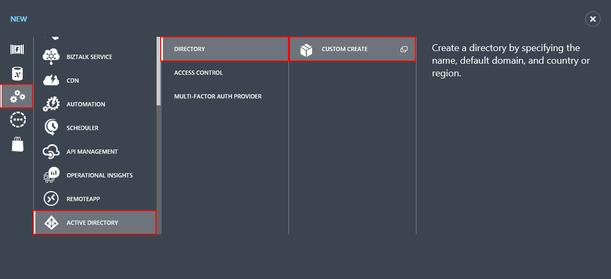

    > _Erstellen eines neuen Verzeichnisses_

	> Geben Sie im **Add directory** Dialog einen Namen für das Verzeichnis, ein Land oder Region, und einen global eindeutigen Domain Namen an. Bestätigen Sie mit der Schaltfläche **Complete**, um das Verzeichnis anzulegen.

	>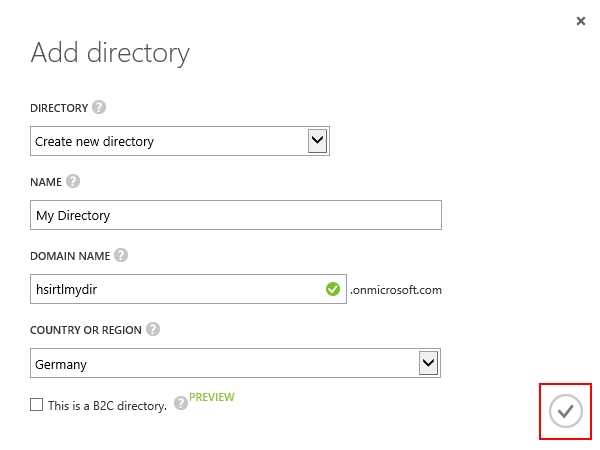

    > _Die Eingabemaske zum Anlegen eines neues Verzeichnisses_

3. Wählen Sie auf der Übersichtsseite zum **Active Directory** Ihr Verzeichnis.

	Legen Sie jetzt einen neuen User mit **Global Administrator** Rolle an. Wählen Sie hierzu den Reiter **Users** aus dem oberen Menü und dann die Schaltfläche **Add User** aus der Befehlszeile.

	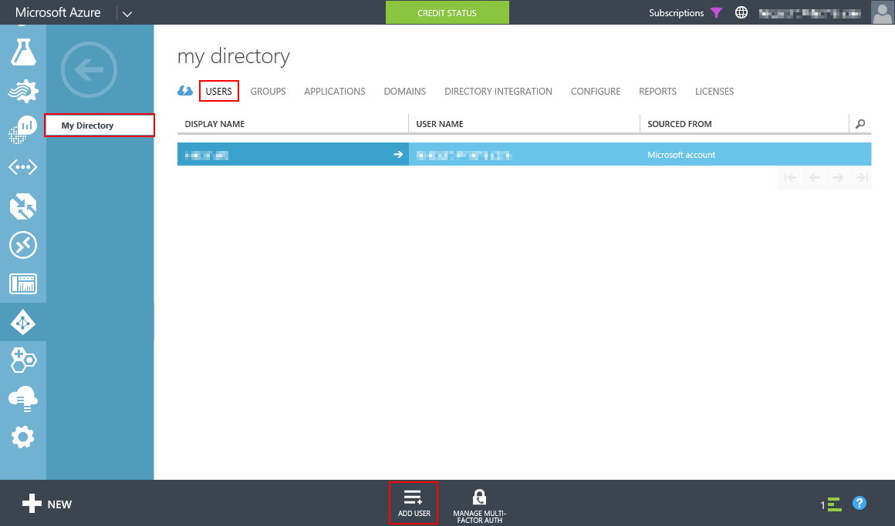

	_Hinzufügen eines Active Directory Users_

5. In der Eingabemaske **Add User** geben Sie einen Namen für den User ein und wählen die Schaltfläche **Next**.

	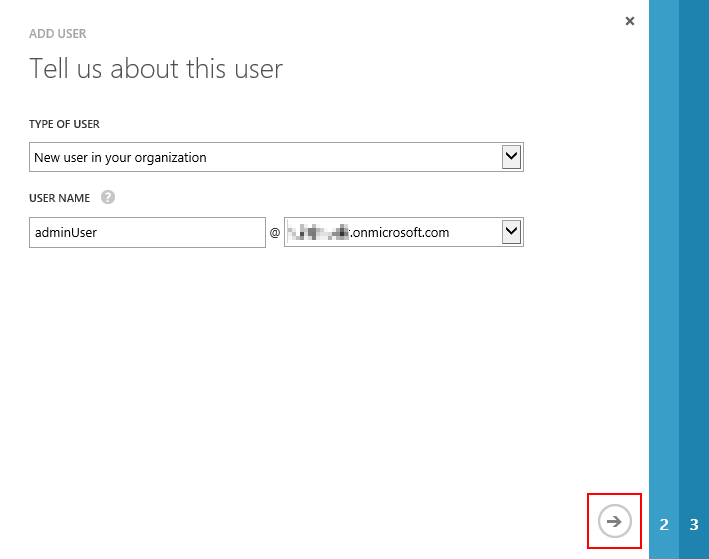

	_Eingabemaske für einen neuen User - Teil 1_

6. Geben Sie auf der nächsten Seite den Namen des Users ein und wählen Sie als Rolle **Global Administrator**. Globale Administratoren benötigen eine alternative E-Mail-Adresse im Falle der Notwendigkeit zur Wiederherstellung des Passwortes. Wählen Sie dann die Schaltfläche **Next**.

	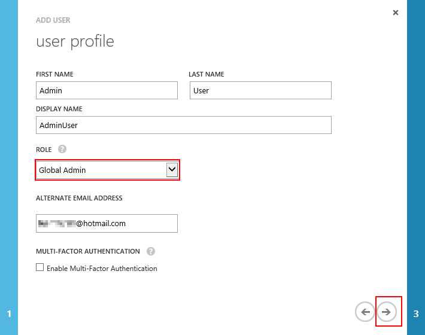

	_Eingabemaske für einen neuen User - Teil 2_

7. Wählen Sie auf der nächsten Seite die Schaltfläche **Create**. Daraufhin wird für den User ein temporäres Passwort erzeugt und in der Eingabemaske angezeigt.

	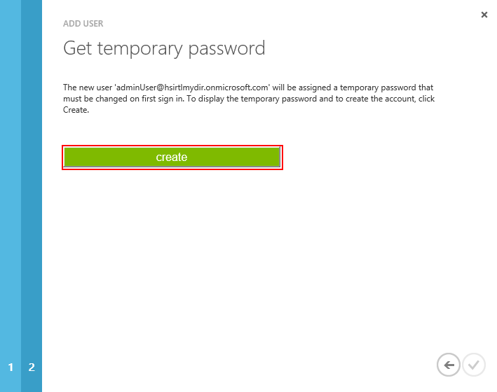

	_Eingabemaske für einen neuen User - Teil 3_

	Notieren Sie sich das Passwort. Sie werden es beim nach dem ersten Anmelden zum Ändern des Passwortes benötigen.

	

    _Eingabemaske für einen neuen User - Teil 4_

	Die folgende Abbildung zeigt den neuen Admin Account.

	> **Hinweis:** Später **müssen** Sie das Azure Active Directory zum anmdelden verwenden, **nicht den Microsoft Account**, den Sie ebenfalls dort sehen.

	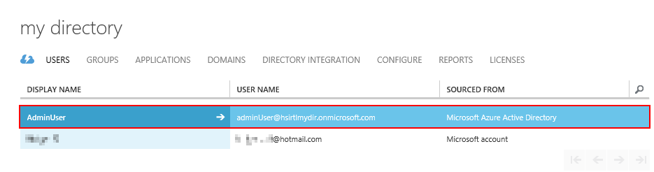

	_Der neue User_

<a name="creating-the-initial-project-for-geek-quiz"></a>
## Erstellen eines initialen Projekts für das Geek Quiz

In dieser Übung werden Sie ein neues ASP.NET MVC Projekt mit ASP.NET Web API Support erstellen. Sie werden dann die Model Classes für das Entity Framework hinzufügen und die Datenbank-Initialisierung zur Speicherung der Quiz-Fragen implementieren.

1. Öffnen Sie Visual Studio und wählen Sie den Menüpunkt **File** > **New** > **Project**.

    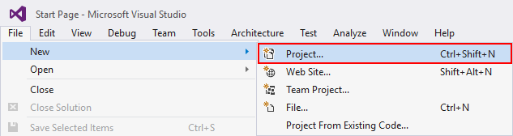

    _Erstellen eines neuen Projekts_

2. In der Eingabemaske **New Project**, wählen Sie den Eintrag **ASP.NET Web Application** im **Visual C# | Web** Tab. Stellen Sie sicher, dass **.NET Framework 4.5** (oder höher) ausgewählt ist, benennen Sie das Projekt _GeekQuiz_ , wählen Sie eine **Location** und bestätigen Sie mit **OK**.

	> **Hinweis:** Falls Sie Applications Insights nicht verwenden wollen, entfernen Sie den Haken bei **Add Application Insights to Project**.

    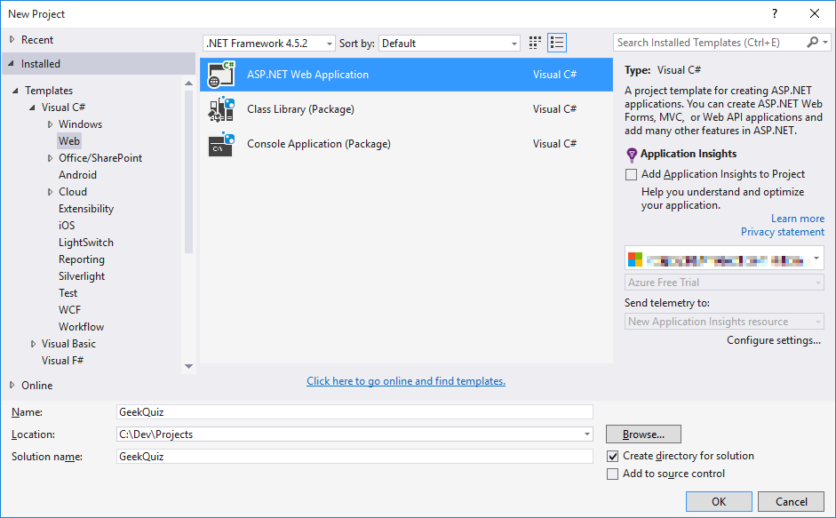

    _Erstellen eines neuen ASP.NET Web Application Projekts_

3. In der Eingabemaske **New ASP.NET Project** wählen Sie **MVC**. Stellen Sie sicher, dass die Option **Host in the cloud** ausgewählt ist, und wählen Sie dann die Schaltfläche **Change Authentication**.

    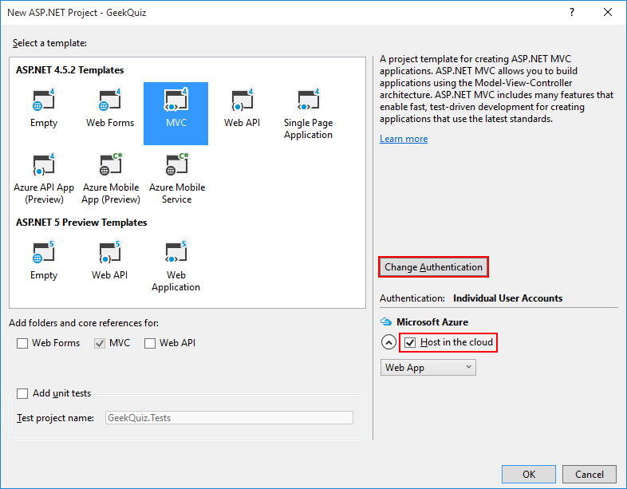

    _Erstellen eines neuen Projekts basierend auf dem MVC Template, einschließlich Web API Komponenten_

4. In der **Change Authentication** Eingabemaske wählen Sie **Work And School Accounts**.

	Mit diesen Einstellungen registrieren Sie Ihre Anwendung automatisch mit Azure AD und konfigurieren die Integration mit Azure AD. Für eine Registrierung beim Azure AD ist **Change Authentication** zwar nicht notwendig, es vereinfacht den Registrierungsprozess aber. Sollten Sie mit Visual Studio 2012 arbeiten, können Sie die Anwendung im Management Portal manuell registrieren und die Integration konfigurieren.

	Wählen Sie in den Dropdown-Listen **Cloud-Single Organization** und Ihr zuvor angelegtes Azure AD Verzeichnis. Markieren Sie die Option **Read directory data**. Bestätigen Sie Ihre Eingabe mit **OK**.

    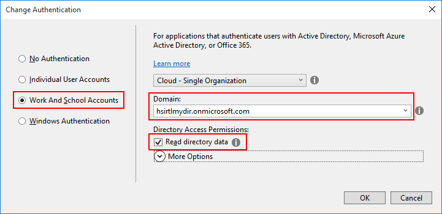

    _Änderung der Authentifizierung_

	Die folgende Abbildung zeigt den Domain-Namen im Azure Portal.

	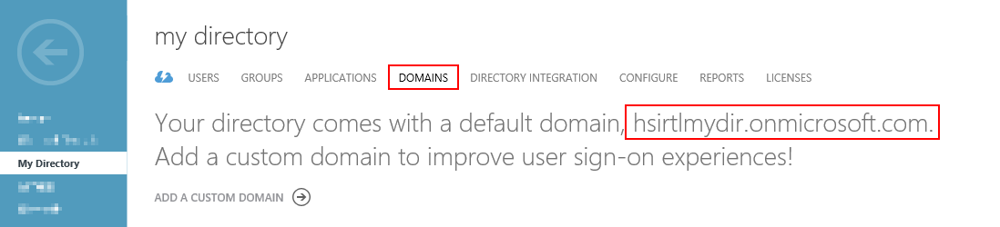

    _Azure Portal_

    > **Hinweis:** Alternativ können Sie über **More Options** die Application ID URI konfigurieren, die im Azure AD registriert wird. Die App ID URI ist die eindeutige ID, mit der sich die Anwendung beim Azure AD anmelden kann. Für weitere Informationen zur App ID URI und weitere Einstellungen für registrierte Anwendungen siehe [hier](http://msdn.microsoft.com/en-us/library/azure/dn499820.aspx#BKMK_Registering).

5. Sofern Sie sich noch nicht zuvor bei Azure angemeldet haben, erscheint nach Auswahl von **OK**, eine Anmeldemaske, über die Sie sich mit dem globalen Administrator Account (nicht dem Microsoft Account, der zu Ihrer Subscription gehört) anmelden können. Wenn Sie sich zum ersten Mal mit diesen Daten anmelden, werden Sie aufgefordert, Ihr Passwort zu ändern und sich neu anzumelden.

	

    _Anmeldung beim Azure Active Directory_

6. Nach erfolgreicher Anmeldung erscheint die **New ASP.NET Project** Eingabemaske dialog will show your authentication choice (**Organizational Auth**) and the directory where the new application will be registered (_your_account_name_.onmicrosoft.com in the image below). Check the box for **Web API**. Click **OK**.

7. Die **Configure Microsoft Azure Web App** Eingabemaske erscheint. Darin ist ein automatisch generierter Name für die Web App sowie eine ausgewählte Region enthalten. Beachten Sie den Account, mit dem Sie an die Maske angemeldet sind. Dies sollte ein Account sein, er Ihrer Azure Subscription zugeordnet ist. Üblicherweise ist dies ein Microsoft Account.

    Dieses Projekt erfordert eine SQL Database. Sie können eine vorhandene Datenbank auswählen oder eine neue erstellen. Eine Datenbank ist deshalb erforderlich, weil das Projekt kleinere Datenmengen zu Authentifizierungen in einem lokalen Datenbanken-File speichert. Wenn Sie die Anwendung deployen, wird dieses Datenbanken-File jedoch nicht in die Anwendung paketiert, weshalb eine Datenbank benötigt wird, die aus der Cloud zugreifbar ist. Bestätigen Sie Ihre Eingaben mit **OK**.

	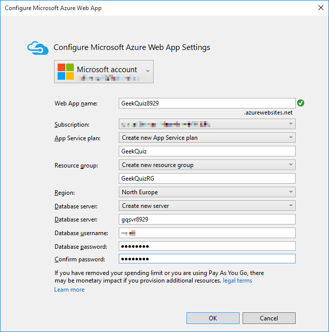

	_Konfiguration der Microsoft Azure Web App_

	Daraufhin legt Visual Studio das Projekt an und fügt die Authentifizierungsinformationen für Azure dem Projekt hinzu. Visual Studio bestätigt dies im **Azure App Service Activity** View.

    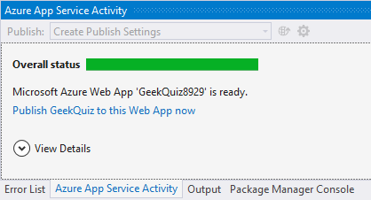

    _Bestätigung des Anlegens des Web App Projekts_

8. Wählen Sie im **Solution Explorer** im **Models** Verzeichnis des **GeekQuiz** Projekts im Kontextmenü den Eintrag **Add | Existing Item**.

    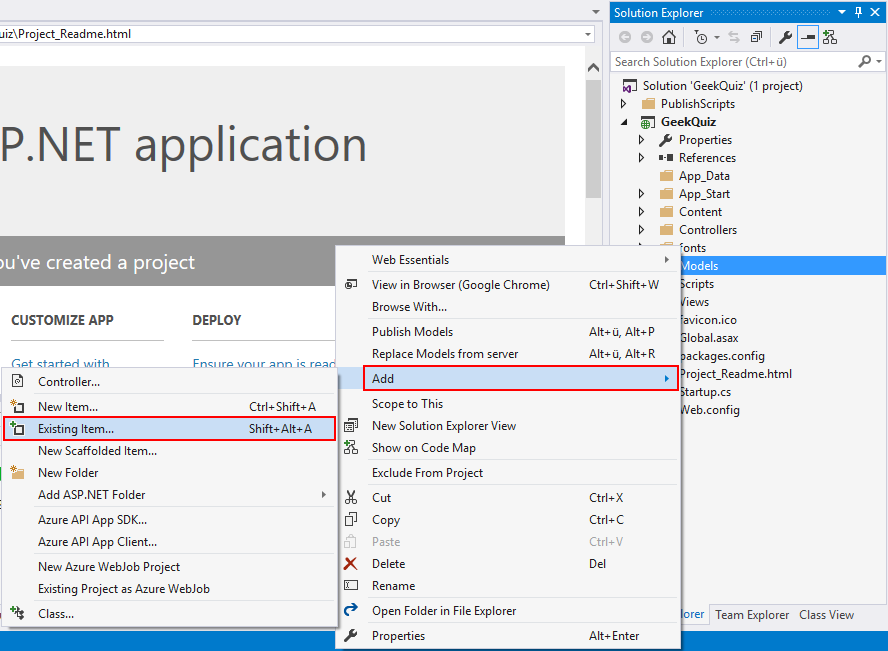

    _Hinzufügen eines bestehenden Elements_

9. Wählen Sie in der Eingaebemaske **Add Existing Item** aus dem Verzeichnis Source/Models dieses Labs alle Dateien aus. Bestätigen Sie mit **Add**.

    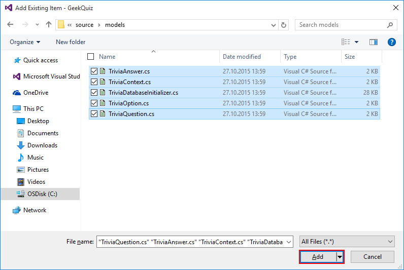

    _Hinzufügen aller Model Klassen_

	> **Hinweis:** Durch Hinzufügen dieser Dateien, fügen Sie das Datenmodell, den Entity Framework Datenbank-Kontext und den Datenbank-Initialisierer der Geek Quiz Anwendung hinzu.

	Das **Entity Framework (EF)** ist ein objekt-relationaler Mapper (ORM), der es ermöglicht, Datenzugriffe mittels eines konzeptionellen Anwendungsmodells anstatt mittels eines direkten relationalen Speicherschemas zu entwickeln. Weitere Informationen zum Entity Framework gibt es [hier](https://entityframework.codeplex.com/).

    Im Folgenden eine Beschreibung der Dateien, die Sie gerade hinzugefügt haben:	

    * **TriviaOption:** repräsentiert eine Antwortmöglichkeit einer Quiz-Frage
    * **TriviaQuestion:** repräsentiert eine Quiz-Frage und stellt Antwortmöglichkeiten über das **Options** Property zur Verfügung
    * **TriviaAnswer:** repräsentiert die durch einen User ausgewählte Antwortmöglichkeit
    * **TriviaContext:** repräsentiert den Entity Framework Datenbank-Kontext der Geek Quiz Anwendung. Diese Klasse ist von **DbContext** abgeleitet und stellt **DbSet** Properties bereit, über die auf die Objekte der oben vorgestellten Klassen zugegriffen werden kann.
    * **TriviaDatabaseInitializer:** die Implementierung des Entity Framework Initialisierers für den **TriviaContext**, welcher wiederum von **CreateDatabaseIfNotExists** abgeleitet ist. Sofern noch keine Datenbank existiert, legt dieser eine an und fügt die in der **Seed** Methode angegebenen Entitys ein.

10. Öffnen Sie die Datei **Global.asax.cs** und fügen Sie das folgende Using Statement hinzu.

    ```C#
    using GeekQuiz.Models;
    ```

11. Aktualisieren Sie die **Application_Start** Methode, indem Sie die Zeile hinzufügen, die den **TriviaDatabaseInitializer** als Datenbank-Initialisierer festlegt.

	<!-- mark:3 -->
    ```C#
	protected void Application_Start()
	{
	    System.Data.Entity.Database.SetInitializer(new TriviaDatabaseInitializer());

	    AreaRegistration.RegisterAllAreas();
	    GlobalConfiguration.Configure(WebApiConfig.Register);
	    FilterConfig.RegisterGlobalFilters(GlobalFilters.Filters);
	    RouteConfig.RegisterRoutes(RouteTable.Routes);
	    BundleConfig.RegisterBundles(BundleTable.Bundles);
	}
    ```

12. Ändern Sie nun den **Home** Controller dahingehend, dass nur authentifizierte User auf dessen Methoden zugreifen können. Öffnen Sie hier zu die Datei **HomeController.cs** im Verzeichnis **Controllers** und fügen Sie das **Authorize** Attribut zur **HomeController** Klassendefinition hinzu.

    <!-- mark:3 -->
    ```C#
    namespace GeekQuiz.Controllers
    {
        [Authorize]
        public class HomeController : Controller
        {
            public ActionResult Index()
            {
                return View();
            }

            ...
        }
    }
    ```

    > **Hinweis:** Der **Authorize** Filter prüft, ob der User authentifiziert ist. Wenn dies nicht der Fall ist, gibt er einen HTTP Statuscode 401 (Unauthorized) zurück, ohne die Aktion auszuführen. Der Filter kann auf Controller Ebene oder auf der Ebene einzelner Aktionen angewandt werden.

13. Passen Sie nun das Layout und das Branding der Webseiten an. Öffnen Sie hierzu die Datei **Layout.cshtml** im Verzeichnis **Views | Shared** und aktualisieren Sie den Inhalt des `<title>` Elements, indem Sie _My ASP.NET Application_ durch _Geek Quiz_ ersetzen.

    <!-- mark:4 -->
    ```HTML
    <head>
        <meta charset="utf-8" />
        <meta name="viewport" content="width=device-width, initial-scale=1.0">
        <title>@ViewBag.Title - Geek Quiz</title>
        @Styles.Render("~/Content/css")
        @Scripts.Render("~/bundles/modernizr")
    </head>
    ```

14. Aktualisieren Sie in der gleichen Datei die Navigationsleiste, indem Sie die Links _About_ und _Contact_ entfernen und den Link _Home_ durch _Play_ ersetzen. Ändern Sie darüber hinaus den Anwendungsnamen in _Geek Quiz_ . Der HTML Code für die Navigationsleiste sollte wie folgt aussehen.

    <!-- mark:9,13 -->
    ```HTML
    <div class="navbar navbar-inverse navbar-fixed-top">
        <div class="container">
            <div class="navbar-header">
                <button type="button" class="navbar-toggle" data-toggle="collapse" data-target=".navbar-collapse">
                    <span class="icon-bar"></span>
                    <span class="icon-bar"></span>
                    <span class="icon-bar"></span>
                </button>
                @Html.ActionLink("Geek Quiz", "Index", "Home", null, new { @class = "navbar-brand" })
            </div>
            <div class="navbar-collapse collapse">
                <ul class="nav navbar-nav">
                    <li>@Html.ActionLink("Play", "Index", "Home")</li>
                </ul>
                @Html.Partial("_LoginPartial")
            </div>
        </div>
    </div>
    ```

15. Aktualisieren Sie die Fußzeile, indem Sie _My ASP.NET Application_ in _Geek Quiz_ ändern. Ersetzen Sie hierzu den Inhalt des `<footer>` Elements durch folgenden Code.

    <!-- mark:5 -->
    ```HTML
    <div class="container body-content">
        @RenderBody()
        <hr />
        <footer>
            <p>&copy; @DateTime.Now.Year - Geek Quiz</p>
        </footer>
    </div>
    ```

<a name="creating-the-triviacontroller-web-api"></a>
## Erstellen der TriviaController Web API

In der letzten Übung haben sie die initiale Struktur der Geek Quiz Web Anwendung erstellt. Im Folgenden werden Sie einen einfachen Web API Service erstellen, der mit dem Quiz Datenmodell interagiert und folgende Methoden bereitstellt:

* **GET /api/trivia:** Liefert die nächste Quizfrage, die von einem angemeldeten User beantwortet werden soll.
* **POST /api/trivia:** Speichert die Antwortoption, die vom User ausgewählt wurde.

Verwenden Sie sie ASP.NET Scaffolding Werkzeuge von Visual Studio, um eine initiale Version der Web API Controller-Klasse zu erzeugen.

1. Öffnen Sie die Datei **WebApiConfig.cs** im Verzeichnis **App_Start**. Diese Date definiert die Konfiguration des Web API Service, d.h. sie bestimmt, wie Abfragen auf Web API Controller Actions abgebildet werden.

2. Fügen Sie folgendes Using Statement am Beginn der Datei ein.

    ```C#
    using Newtonsoft.Json.Serialization;
    ```

3. Aktualisieren Sie die **Register** Methode, um den Formatierer für die JSON Daten, die über die Web API empfangen werden, global festzulegen. Editieren Sie die entsprechenden Zeilen wie folgt:

    <!-- mark:7-8 -->
    ```C#
    public static class WebApiConfig
    {
        public static void Register(HttpConfiguration config)
        {
            // Web API configuration and services

            // Use camel case for JSON data.
            config.Formatters.JsonFormatter.SerializerSettings.ContractResolver = new CamelCasePropertyNamesContractResolver();

            // Web API routes
            config.MapHttpAttributeRoutes();

            config.Routes.MapHttpRoute(
                name: "DefaultApi",
                routeTemplate: "api/{controller}/{id}",
                defaults: new { id = RouteParameter.Optional }
            );
        }
    }
    ```

    > **Hinweis:** Der **CamelCasePropertyNamesContractResolver** konvertiert automatisch die Property-Namen in das Camel Case Format, welches die allgemeine Konvention für Propertynamen in JavaScript ist.

4. Klicken Sie im **Solution Explorer** mit der rechten Maustaste auf das **Controllers** Verzeichnis im **GeekQuiz** Projekt und wählen Sie den Menüpunkt **Add | New Scaffolded Item...**.

    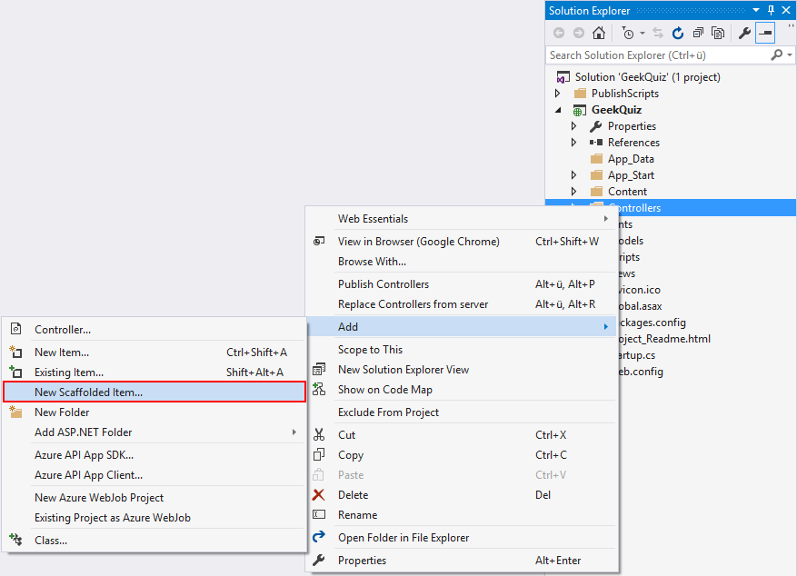

    _Erstellung eines neuen Scaffolded Items_

5. Stellen Sie in der Eingabemaske **Add Scaffold** sicher, dass der **Common** Knoten auf der linken Seite ausgewählt ist. Markieren Sie die Vorlage **Web API 2 Controller - Empty** im mittleren Bereich und bestätigen Sie mit **Add**.

    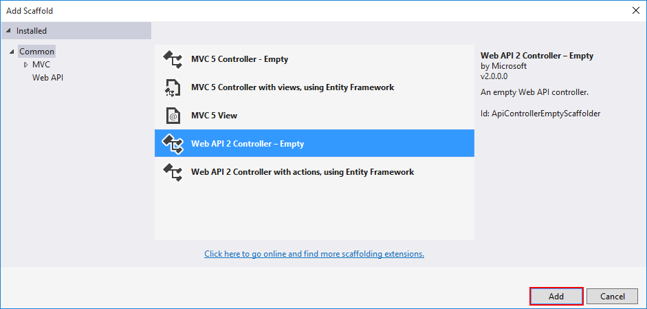

    _Auswahl der Web API 2 Controller Empty Vorlage_

    > **Hinweis:** **ASP.NET Scaffolding** ist ein Code-Generierungsframework für ASP.NET Web Anwendungen. Visual Studio 2015 enthält bereits vorinstalliert Code-Generatoren für MVC und Web API Projekte. Sie sollten Scaffolding in Ihren Projekten verwenden, wenn Sie schnell Code, der mit Datenmodellen interagiert generieren möchten.

	Der Scaffolding Prozess stellt zudem sicher, dass alle benötigte Abhängigkeiten in das Projekt installiert werden. Wenn Sie beispielsweise mit einem leeren ASP.NET Projekt starten und mittels Scaffolding einen Web API Controller hinzufügen, werden die benötigte Web API NuGet Packages und Referenzen automatische zum Projekt hinzugefügt.

6. Tragen Sie in der **Add Controller** Eingabemaske als Namen für den Controller _TriviaController_ ein und bestätigen Sie mit **Add**.

    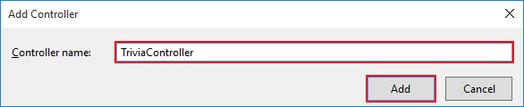

    _Hinzufügen des Trivia Controllers_

7. Die Datei **TriviaController.cs** wird zum Verzeichnis **Controllers**. Die Datei enthält eine leere **TriviaController** Klasse. Fügen Sie folgende Using Statements am Anfang der Datei ein.

    ```C#
    using System.Data.Entity;
    using System.Threading;
    using System.Threading.Tasks;
    using System.Web.Http.Description;
    using GeekQuiz.Models;
    ```

8. Fügen Sie am Anfang der **TriviaController** Klasse folgende Code-Zeilen ein, um die **TriviaContext** Instanz im Controller zu definieren, initialisieren und zu entsorgen.

    <!-- mark:3-13 -->
    ```C#
    public class TriviaController : ApiController
    {
        private TriviaContext db = new TriviaContext();

        protected override void Dispose(bool disposing)
        {
            if (disposing)
            {
                this.db.Dispose();
            }

            base.Dispose(disposing);
        }
    }
    ```

	> **Hinweis:** Die **Dispose** Methode des **TriviaController**s ruft die **Dispose** Methode der **TriviaContext** Instanz auf, was sicherstellt, dass alle Ressourcen, die vom Context-Objekt verwendet werden, wieder freigegeben werden, wenn die TriviaContext Instanz entfernt oder vom Garbage-Collector beseitigt wird. Dies schließt das Schließen aller Datenbank-Verbindungen, die durch das Entity Framework geöffnet werden, mit ein.

9. Fügen Sie folgende Hilfsmethoden am Ende der **TriviaController** Klasse ein. Diese Methode ermittelt die nächste Quiz-Frage von der Datenbank.

    ```C#
    private async Task<TriviaQuestion> NextQuestionAsync(string userId)
    {
        var lastQuestionId = await this.db.TriviaAnswers
            .Where(a => a.UserId == userId)
            .GroupBy(a => a.QuestionId)
            .Select(g => new { QuestionId = g.Key, Count = g.Count() })
            .OrderByDescending(q => new { q.Count, QuestionId = q.QuestionId })
            .Select(q => q.QuestionId)
            .FirstOrDefaultAsync();

        var questionsCount = await this.db.TriviaQuestions.CountAsync();

        var nextQuestionId = (lastQuestionId % questionsCount) + 1;
        return await this.db.TriviaQuestions.FindAsync(CancellationToken.None, nextQuestionId);
    }
    ```

10. Fügen Sie die folgende **Get** Action Methode in die **TriviaController** Klasse ein. Diese Action Methode ruft die **NextQuestionAsync** Hilfsmethode auf.

    ```C#
    // GET api/Trivia
    [ResponseType(typeof(TriviaQuestion))]
    public async Task<IHttpActionResult> Get()
    {
        var userId = User.Identity.Name;

        TriviaQuestion nextQuestion = await this.NextQuestionAsync(userId);

        if (nextQuestion == null)
        {
            return this.NotFound();
        }

        return this.Ok(nextQuestion);
    }
    ```

11. Fügen Sie folgende Hilfsmethode am Ende der **TriviaController** Klasse ein. Diese Methode speichert die ausgewählte Antwort in der Datenbank und liefert einen boole'schen Wert zurück, der angibt, ob die Antwort korrekt oder falsch war.

    ```C#
    private async Task<bool> StoreAsync(TriviaAnswer answer)
    {
        this.db.TriviaAnswers.Add(answer);

        await this.db.SaveChangesAsync();
        var selectedOption = await this.db.TriviaOptions.FirstOrDefaultAsync(o => o.Id == answer.OptionId
            && o.QuestionId == answer.QuestionId);

        return selectedOption.IsCorrect;
    }
    ```

12. Fügen Sie folgende **Post** Action Methode zur **TriviaController** Klasse hinzu. Diese Action Method weist die Antwort dem angemeldeten User zu und ruft die **StoreAsync** Hilfsmethode auf. Im Anschluss liefert Sie eine Antwort mit dem boole'schen Wert der Hilfsmethode zurück.

    ```C#
    // POST api/Trivia
    [ResponseType(typeof(TriviaAnswer))]
    public async Task<IHttpActionResult> Post(TriviaAnswer answer)
    {
        if (!ModelState.IsValid)
        {
            return this.BadRequest(this.ModelState);
        }

        answer.UserId = User.Identity.Name;

        var isCorrect = await this.StoreAsync(answer);
        return this.Ok<bool>(isCorrect);
    }
    ```

13. Ändern Sie den Web API Controller dahingehend, dass Zugriffe nur durch authentifizierte User erfolgen dürfen, indem Sie das **Authorize** Attribut an die **TriviaController** Klassendefinition hängen.

    <!-- mark:1 -->
    ```C#
    [Authorize]
    public class TriviaController : ApiController
    {
        ...
    }
	```

<a name="running-the-solution"></a>
## Ausführen der Solution

In dieser Übung werden Sie überprüfen, ob die Web API, die Sie in der letzten Übung implementiert haben, wie gewünscht arbeitet. Sie werden die Internet Explorer F12 Entwicklertools dazu verwenden, den Netzwerk-Traffic zu überwachen und die Antwort des Web API Service zu untersuchen.

> **Hinweis:** Stellen Sie sicher, dass der Internet Explorer in der Start Schaltfläche in der Visual Studio Toolbar eingestellt ist.

> 

> _Internet Explorer als Standardbrowser_

1. Drücken Sie **F5**, um die Solution auszuführen. Die Login Seite sollte am Bildschirm angezeigt werden.

    > **Hinweis 1:** Wenn Die Anwendung startet, wird die voreingestellte MVC Route gewählt, welche per Default auf die Index Action der HomeController Klasse zeigt. Nachdem der HomeController auf angemeldete User zugriffsbeschränkt und noch kein User authentifiziert ist, leitet die Anwender den User auf die Login Seite weiter.
	>
	> **Hinweis 2:** Das erste Mal, wenn Sie die Anwendung lokal ausführen, werden Sie ggf. gefragt, ob Sie dem IIS Express SSL Zertifikat trauen. Wenn Sie dies tun, wählen Sie Yes und akzeptieren Sie die Installation des Zertifikats. IIS Express ist eine leichtgewichtige, self-contained Version von IIS, die für Entwickler optimiert wurde, die Web Anwendungen lokal debuggen wollen.

2. Geben Sie die Active Directory Credentials des oben angelegten Users an.

    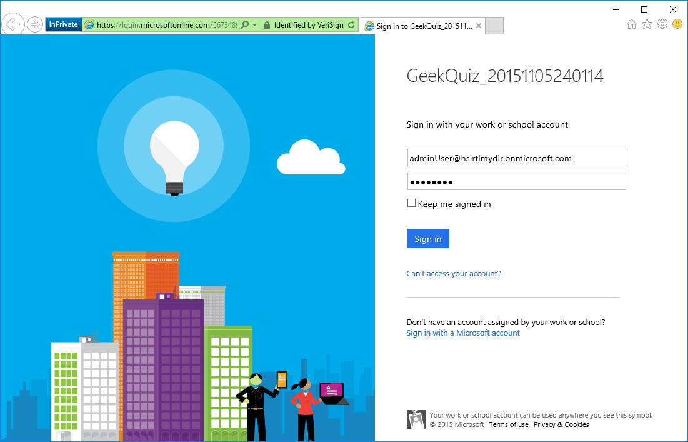

    _AD Anmeldeseite_

3. Nachdem Sie sich erfolgreich angemeldet haben, lädt die Anwendung die Default Action des Home Controllers. Diese wiederum zeigt auf die Startseite. Beachten Sie, dass in der Menüleiste der angemeldete User angezeigt wird.

    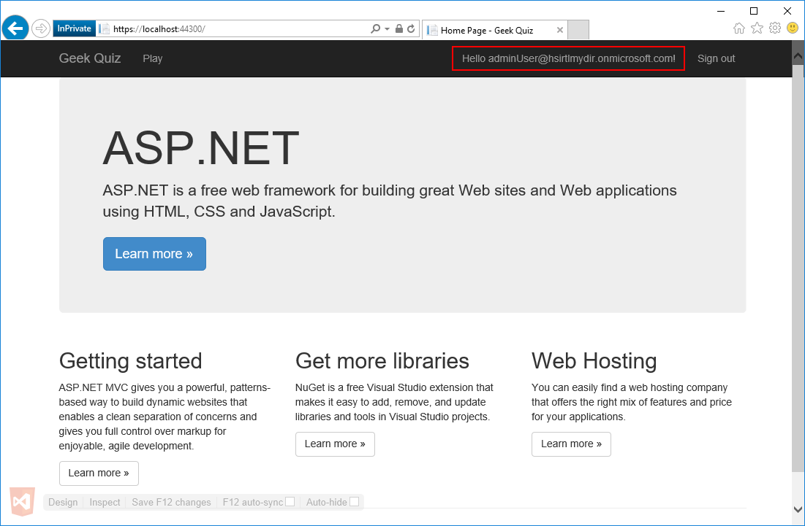

    _Ausführen der Solution_

4. Klicken Sie auf den Namen des angemeldeten Users oben in der Menüleiste.

    Dies bringt Sie auf die **User Profile** Seite, welche eine Aktion des **UserProfileController**s ist. Beachten Sie, dass die Tabelle Infrmationen zum User, den Sie oben angelegt haben, enthält. Diese Information stammt aus dem Azure AD. Der Controller verwendet die Graph API, um die Informationen aus dem AD auszulesen.

	> **Hinweis:** Die [Graph API](http://msdn.microsoft.com/en-us/library/azure/hh974476.aspx) ist die Programmierschnittstelle, mit der CRUD und andere Operationen auf Objekten in Ihrem Azure AD ausgeführt werden können.

	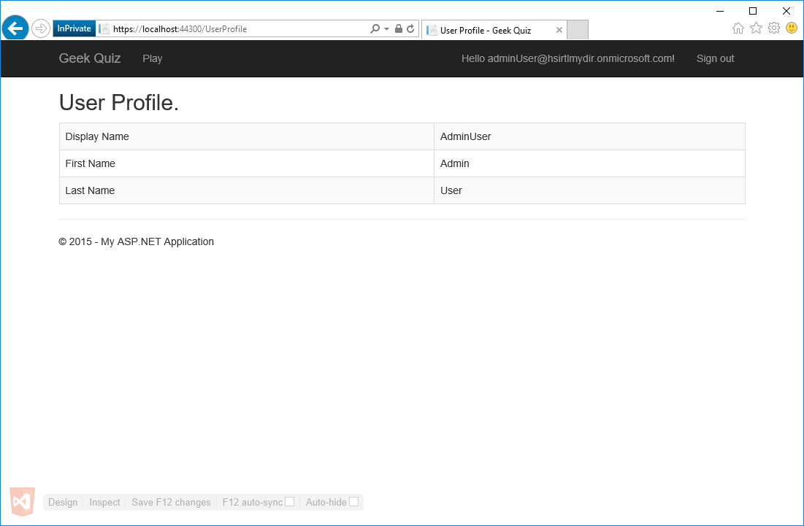

    _User Profil Seite_

5. Kehren Sie zu Visual Studio zurück und klappen Sie das Verzeichnis **Controllers** auf und öffnen Sie darin die **HomeController.cs** Datei.

	Dort finden Sie eine **UserProfile()** Action, die Code enthält, mit der ein Token beschafft und mit diesem dann die Graph API aufgerufen werden kann. Der Code sieht wie folgt aus:

	<!-- mark:22 -->
	```C#
	[Authorize]
	public async Task UserProfile()
	{
		string tenantId = ClaimsPrincipal.Current.FindFirst(TenantIdClaimType).Value;

		// Get a token for calling the Azure Active Directory Graph
		AuthenticationContext authContext = new AuthenticationContext(String.Format(CultureInfo.InvariantCulture, LoginUrl, tenantId));
		ClientCredential credential = new ClientCredential(AppPrincipalId, AppKey);
		AuthenticationResult assertionCredential = authContext.AcquireToken(GraphUrl, credential);
		string authHeader = assertionCredential.CreateAuthorizationHeader();
		string requestUrl = String.Format(
		    CultureInfo.InvariantCulture,
		    GraphUserUrl,
		    HttpUtility.UrlEncode(tenantId),
		    HttpUtility.UrlEncode(User.Identity.Name));

		HttpClient client = new HttpClient();
		HttpRequestMessage request = new HttpRequestMessage(HttpMethod.Get, requestUrl);
		request.Headers.TryAddWithoutValidation("Authorization", authHeader);
		HttpResponseMessage response = await client.SendAsync(request);
		string responseString = await response.Content.ReadAsStringAsync();
		UserProfile profile = JsonConvert.DeserializeObject<UserProfile>(responseString);

		return View(profile);
	}
	```

	Um die Graph API aufrufen zu können, benötigen Sie zunächst ein Token. Nachdem dieses beschafft wurde, muss dessen String-Wert in den Authorization-Header aller Folgeaufrufe an die Graph API eingefügt werden.
    
    Der größte Teil des Codes oben dient dazu, sich beim Azure AD anzumelden, um unter Übergabe des Authentifizierungstoken einen Zugriffstoken zu erhalten. Die wichtigste Zeile ist die folgende:

	`UserProfile profile = JsonConvert.DeserializeObject<UserProfile>(responseString);`

    In dieser Zeile wird das Benutzerprofil aus dem in JSON formatierten Response-Objekt extrahiert.

    Sie können die Graph API mit beliebigen HttpClients aufrufen und die Rohdaten selbst auswerten. Einfacher sind die Zugriffe mit Hilfe der [Graph Client Library](http://www.nuget.org/packages/Microsoft.Azure.ActiveDirectory.GraphClient/), die via NuGet verfügbar ist. Die Client Library übernimmt die Auswertung der rohen HTTP Requests und die Umwandlung der zurückgegebenen Daten und vereinfacht die Interaktion mit der Graph API aus einer .NET Umgebung heraus maßgeblich. Codebeispiele und weitere Dokumentation zur Graph API findet sich auch auf [GitHub](https://github.com/AzureADSamples).

6. Wechseln Sie zurück zum Browser und navigieren Sie zurück zur Homepage.

7. Wählen Sie im Browser die Option **F12**, um die Entwicklertools zu öffnen. Drücken Sie **CTRL+4** oder das Netzwerk-Icon und aktivieren Sie den grünen Play-Button, um den Netzwerkverkehr aufzuzeichnen.

    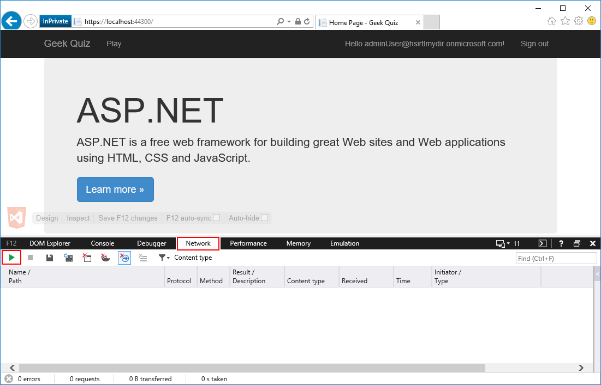

    _Starten des Capturings des Web API Netzwerk Traffics_

8. Hängen Sie an den URL im Browser die Zeichenfolge _api/trivia_ und bestätigen Sie mit **Enter**. Jetzt können Sie die Details der Rückgabe der GET Action Methode des TriviaControllers einsehen.

    

    _Ermitteln der nächsten Frage durch die Web API_

	> **Hinweis:** Sobald der Download abgeschlossen ist, werden Sie gefragt, was Sie mit der heruntergeladenen Datei machen möchten. Lassen Sie den Dialog offen, damit Sie den Inhalt der Antwort untersuchen können.

9. Untersuchen Sie jetzt den Body der Antwort. Klicken Sie hierzu auf den **Details** Tab und dort dann auf **Body**.

	Sie können sich die heruntergeladenen Daten ansehen. Diese bestehen aus einer Frage sowie zugehörigen Antwortmöglichkeiten.

    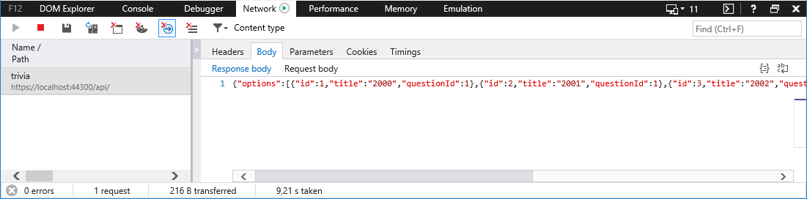

    _Anzeige des Web API Response Body_

10. Kehren Sie zu Visual Studio zurück und drücken Sie **SHIFT + F5**, um das Debugging zu stoppen.

<a name="creating-the-spa-interface-using-angularjs"></a>
## Erstellen des SPA Interface mit Hilfe von AngularJS

In dieser Übung verwenden Sie **AngularJS**, um den Client für die GeekQuiz Anwendung zu implementieren. **AngularJS** ist ein Open-Source JavaScript Framework, welches Browser-basierte Anwendungen um die Möglichkeiten des Model-View-Controller-Ansatzes (MVC) erweitert.

Zunächst werden Sie AngularJS über die Visual Studio **Package Manager Console** installieren. Danach werden Sie einen Controller erstellen, der die Funktionalität der GeekQuiz App umsetzt, d.h. die Anzeige von Quiz-Fragen und -Antworten über die AngularJS Template Engine.

> **Hinweis:** Für weitere Informationen zu AngularJS, siehe [http://angularjs.org/](http://angularjs.org/).

1. Öffnen Sie die **Package Manager Console** über das Menü **Tools | Nuget Package Manager | Package Manager Console**. Tippen Sie das folgende Kommando, um das **AngularJS.Core** NuGet Package zu installieren.

    ```C#
    Install-Package AngularJS.Core
    ```
    Warten Sie, bis das Package heruntergeladen und installiert ist.

2. Im **Solution Explorer** klicken Sie mit der rechten Maustaste auf das **Scripts** Verzeichnis des **GeekQuiz** Projekts und wählen Sie den Menüpunkt **Add | New Folder**. Benennen Sie das Verzeichnis **app** und bestätigen Sie mit **Enter**.

3. Klicken Sie mit der rechten Maustaste auf das **app** Verzeichnis und wählen Sie den Menüpunkt **Add | JavaScript File**.

    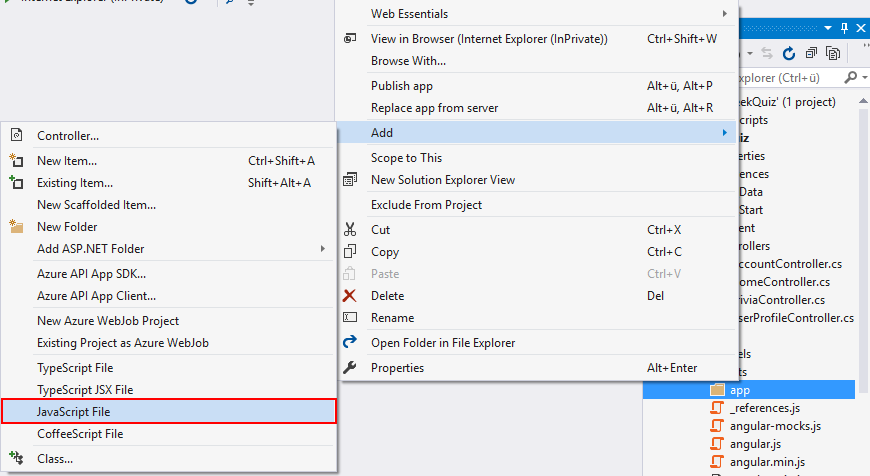

    _Hinzufügen einer JavaScript Datei_

4. In der **Specify Name for Item** Eingabemaske geben Sie als Namen _quiz-controller_ ein und bestätigen Sie mit **OK**.

    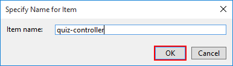

    _Benennung der JavaScript Datei_

5. Fügen Sie in der Datei **quiz-controller.js** den folgenden Code hinzu, um den AngularJS **QuizCtrl** Controller zu deklarieren und zu initialisieren.

    <!-- mark:1-12 -->
    ```JS
    angular.module('QuizApp', [])
        .controller('QuizCtrl', function ($scope, $http) {
            $scope.answered = false;
            $scope.title = "loading question...";
            $scope.options = [];
            $scope.correctAnswer = false;
            $scope.working = false;

            $scope.answer = function () {
                return $scope.correctAnswer ? 'correct' : 'incorrect';
            };
        });
    ```

	> **Hinweis:** Der Konstruktor des **QuizCtrl** Controllers erwartet einen Parameter namens **$scope**. Der initiale Zustand des Scopes sollte in der Konstruktor-Funktion eingerichtet werden, in dem zum **$scope** Objekt Properties hinzugefügt werden. Diese Properties enthalten das **view model**. Sie werden durch die Vorlage zugreifbar sein, wenn der Controller registriert ist.

    Der **QuizCtrl** Controller  ist innerhalb eines Moduls namens **QuizApp** definiert. Module sind Arbeitseinheiten, die es ermöglichen, die Anwendung in einzelne Komponenten zu unterteilen. Der Hauptvorteil der Verwendung von Modulen liegt in der besseren Lesbarkeit und Verständlichkeit und den besseren Möglichkeiten zum Testen, Wiederverwenden und Warten.

6. Fügen Sie nun Verhalten zu dem Scope, um auf Ereignisse aus dem View reagieren zu können. Fügen Sie hierzu folgenden Code an das Ende des **QuizCtrl** Controllers, um die Funktion **nextQuestion** im **$scope** Objekt zu definieren.

    <!-- mark:4-19 -->
    ```JS
    .controller('QuizCtrl', function ($scope, $http) {
        ...

        $scope.nextQuestion = function () {
            $scope.working = true;
            $scope.answered = false;
            $scope.title = "loading question...";
            $scope.options = [];

            $http.get("/api/trivia").success(function (data, status, headers, config) {
                $scope.options = data.options;
                $scope.title = data.title;
                $scope.answered = false;
                $scope.working = false;
            }).error(function (data, status, headers, config) {
                $scope.title = "Oops... something went wrong";
                $scope.working = false;
            });
        };
    };
    ```

	> **Hinweis:** Diese Funktion holt die nächste Frage von der **Trivia** Web API und fügt die Daten der Frage in das **$scope** Objekt ein.

7. Fügen Sie folgenden Code ans Ende des **QuizCtrl** Controllers, um die **sendAnswer** Funktion in das **$scope** Objekt einzufügen.

    <!-- mark:4-15 -->
    ```JS
    .controller('QuizCtrl', function ($scope, $http) {
        ...

        $scope.sendAnswer = function (option) {
            $scope.working = true;
            $scope.answered = true;

            $http.post('/api/trivia', { 'questionId': option.questionId, 'optionId': option.id }).success(function (data, status, headers, config) {
                $scope.correctAnswer = (Boolean(data) === true);
                $scope.working = false;
            }).error(function (data, status, headers, config) {
                $scope.title = "Oops... something went wrong";
                $scope.working = false;
            });
        };
    };
    ```

	> **Hinweis:** Diese Funktion sendet die vom User ausgewählte Anwort an die **Trivia** Web API und speichert das Ergebnis, d.h. ob die Antwort richtig oder falsch war, im **$scope** Objekt.

    Die beiden Funktionen **nextQuestion** und **sendAnswer**, die Sie in den letzten Schritten hinzugefügt haben, verwenden das **$http** Objekt von AngularJS, um von der Communikation des Browsers mit der Web API via XMLHttpRequest JavaScript-Objekt zu abstrahieren. AngularJS unterstützt einen weiteren Service, der eine höhere Abstrahierung zur Durchführung von CRUD Operationen einer RESTful API bietet. Das AngularJS **$resource** Objekt hat Action Methoden, die von der direkten Verwendung des **$http** Objekts abstrahieren. Sie sollten das **$resource** Objekt in Szenarien verwenden, bei denen ein CRUD Modell zum Einsatz kommt (für weitere Informationen siehe die [Dokumentation des $resource Objekts](http://docs.angularjs.org/api/ngResource/service/$resource)).

8. Der nächste Schritt dient dazu, das AngularJS Template, das den View für das Quiz definiert. Öffnen Sie hierzu die Datei **Index.cshtml** im Verzeichnis **Views | Home** und ersetzen Sie deren Inhalt durch folgenden Code.

	```HTML
    @{
        ViewBag.Title = "Play";
    }

    <div id="bodyContainer" ng-app="QuizApp">
        <section id="content">
            <div class="container" >
                <div class="row">
                    <div class="flip-container text-center col-md-12" ng-controller="QuizCtrl" ng-init="nextQuestion()">
                        <div class="back" ng-class="{flip: answered, correct: correctAnswer, incorrect:!correctAnswer}">
                            <p class="lead">{{answer()}}</p>
                            <p>
                                <button class="btn btn-info btn-lg next option" ng-click="nextQuestion()" ng-disabled="working">Next Question</button>
                            </p>
                        </div>
                        <div class="front" ng-class="{flip: answered}">
                            <p class="lead">{{title}}</p>
                            <div class="row text-center">
                                <button class="btn btn-info btn-lg option" ng-repeat="option in options" ng-click="sendAnswer(option)" ng-disabled="working">{{option.title}}</button>
                            </div>
                        </div>
                    </div>
                </div>
            </div>
        </section>
    </div>

    @section scripts {
        @Scripts.Render("~/Scripts/angular.js")
        @Scripts.Render("~/Scripts/app/quiz-controller.js")
    }
    ```

	> **Hinweis:** Das AngularJS Template ist eine deklarative Spezifikation, die Informationen aus dem Model verwendet und den Controller dazu verwendet, das statische Markup in die dynamische Ansicht, die der User im Browser angezeigt bekommt, zu transformieren. Im folgenden Beispiele für AngularJS Elemente und Elementattribute, die in einem Template verwendet werden können:
	* Die **ng-app** Direktive kennzeichnet für AngularJS das DOM Element, welches das Root-Element der Anwendung ist.
	* Die **ng-controller** Direktive hängt einen Controller in das DOM an dem Punkt, an dem die Direktive deklariert ist.
	* Die geschweiften Klammern **{{ }}** beschreiben Bindinge zu Scope Properties im Controller.
	* Die **ng-click** Direktive wird dazu verwendet, Funktionen im Scope als Reaktion auf Benutzer-Clicks zu definieren.

9. Öffnen Sie die Datei **Site.css** im Verzeichnis **Content** und fügen Sie die folgenden Styles ans Dateiende, um die Oberfläche für den Quiz View zu gestalten.

	```CSS
    .validation-summary-valid {
         display: none;
    }

    /* Geek Quiz styles */
    .flip-container .back,
    .flip-container .front {
         border: 5px solid #00bcf2;
         padding-bottom: 30px;
         padding-top: 30px;
    }

    #content {
        position:relative;
        background:#fff;
        padding:50px 0 0 0;
    }

    .option {
         width:140px;
         margin: 5px;
    }

    div.correct p {
         color: green;
    }

    div.incorrect p {
         color: red;
    }

    .btn {
         border-radius: 0;
    }

    .flip-container div.front, .flip-container div.back.flip {
        display: block;
    }

    .flip-container div.front.flip, .flip-container div.back {
        display: none;
    }
	```

<a name="running-the-single-page-application"></a>
## Ausführen der Single Page Application

In dieser Übung führen Sie die Solution mit der via AngularJS neu gestalteten Benutzeroberfläche aus und beantworten einige der Quiz-Fragen.

1. Drücken Sie **F5**, um die Solution zu starten.

2. Geben Sie Ihre Active Directory Credentials zur Anmeldung ein.

3. Die Startseite sollte angezeigt werden und die erste Frage anzeigen. Beantworten Sie die Frage durch Auswahl einer Optionen. Dies ruft die sendAnswer Funktion auf, welche die ausgewählte Option an die Trivia Web API schickt.

    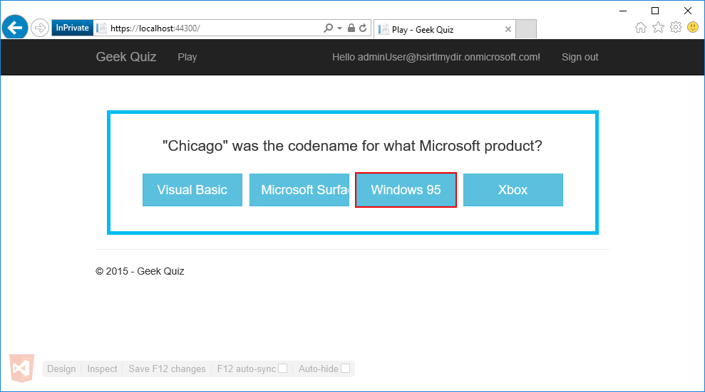

    _Beantwortung einer Frage_

4. Nach Auswahl einer Alternative sollte die Auswertung angezeigt werden. Wählen Sie **Next Question** zur Anzeige der nächsten Frage. Dies ruft die Funktion nextQuestion im Controller auf.

    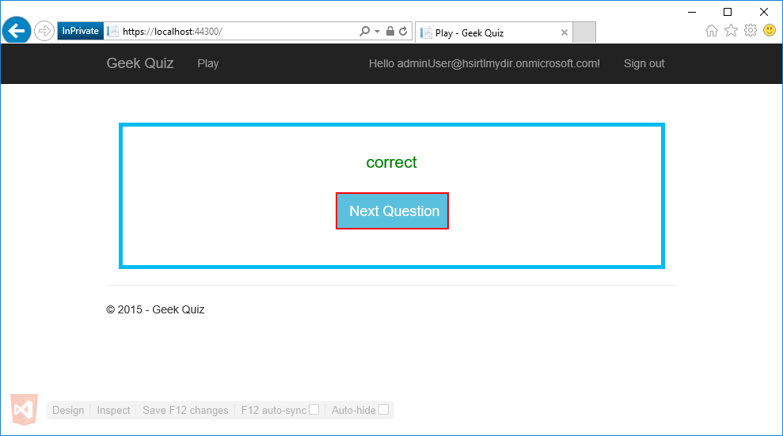

    _Anforderung der nächsten Frage_

5. Die nächste Frage sollte angezeigt werden. 

    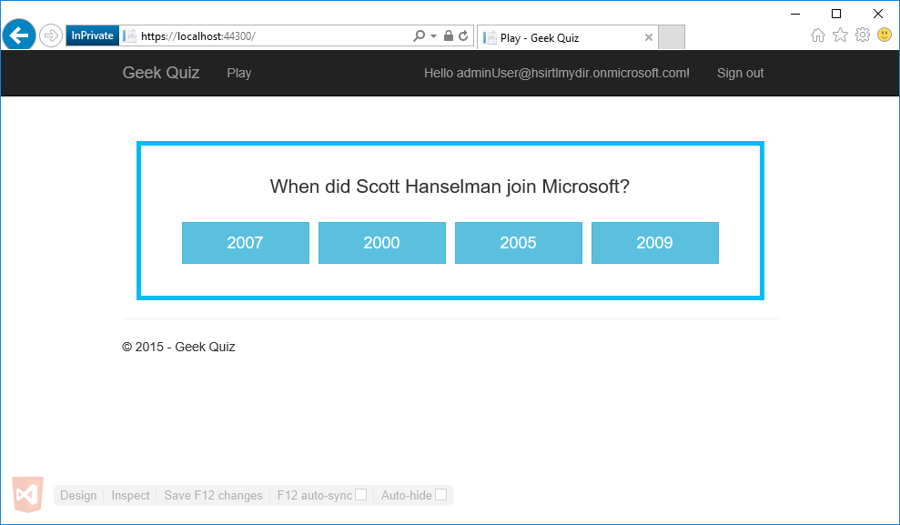

    _Anzeige der nächsten Frage_

6. Kehren Sie zu Visual Studio zurück und drücken Sie **SHIFT + F5**, um das Debugging zu beenden.

<a name="creating-a-flip-animation-using-css3"></a>
## Erstellen einer Flip Animation mit Hilfe von CSS3

In dieser Übung werden Sie CSS3 Properties dazu verwenden, Animationen einzubauen, indem ein Flip-Effekt ausgelöst wird, wenn eine Frage beantwortet und eine neue Frage ausgegeben wird.

1. Klicken Sie im **Solution Explorer** mit der rechten Maustaste das Verzeichnis **Content** des **GeekQuiz** Projekts und wählen Sie den Menüpunkt **Add | Existing Item...**.

    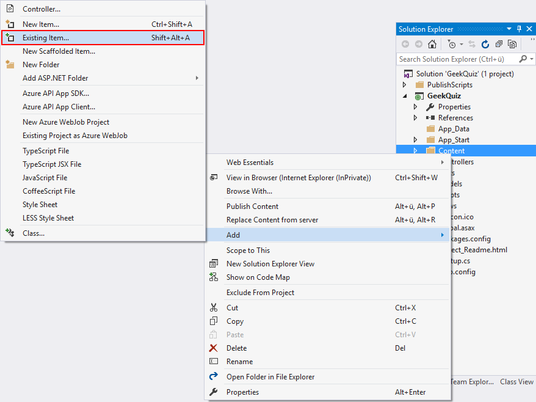

    _Hinzufügen eines neuen Elements zum Verzeichnis Content_

2. Navigieren Sie in der Eingabemaske **Add Existing Item** zum Verzeichnis **Source/css** und wählen Sie die Datei **Flip.css**. Bestätigen Sie mit **Add**.

    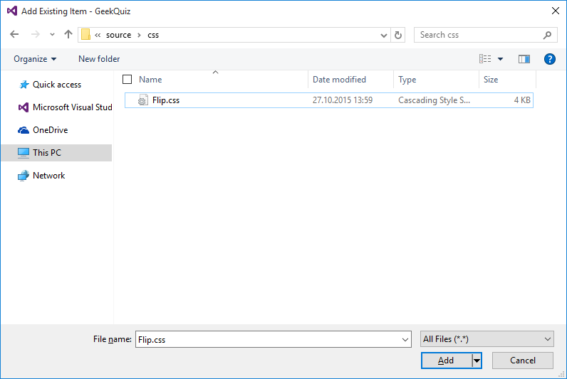

    _Hinzufügen der Datei Flip.css_

3. Öffnen Sie die Datei **Flip.css** und sehen Sie sich ihren Inhalt an.

4. Gehen Sie zum Kommentar **flip transformation**. Die darunter stehenden Styles erzeugen einen "card flip" Effekt.

    ```CSS
    /* flip transformation */
    .flip-container div.front {
        -moz-transform: perspective(2000px) rotateY(0deg);
        -webkit-transform: perspective(2000px) rotateY(0deg);
        -o-transform: perspective(2000px) rotateY(0deg);
        transform: perspective(2000px) rotateY(0deg);
    }

	.flip-container div.front.flip {
		-moz-transform: perspective(2000px) rotateY(179.9deg);
		-webkit-transform: perspective(2000px) rotateY(179.9deg);
		-o-transform: perspective(2000px) rotateY(179.9deg);
		transform: perspective(2000px) rotateY(179.9deg);
	}

    .flip-container div.back {
        -moz-transform: perspective(2000px) rotateY(-180deg);
        -webkit-transform: perspective(2000px) rotateY(-180deg);
        -o-transform: perspective(2000px) rotateY(-180deg);
        transform: perspective(2000px) rotateY(-180deg);
    }

	.flip-container div.back.flip {
		-moz-transform: perspective(2000px) rotateY(0deg);
		-webkit-transform: perspective(2000px) rotateY(0deg);
		-ms-transform: perspective(2000px) rotateY(0);
		-o-transform: perspective(2000px) rotateY(0);
		transform: perspective(2000px) rotateY(0);
	}
    ```

5. Suchen Sie den Kommentar **hide back of pane during flip**.

    Die Style-Regel versteckt die Rückseite der Karten.

    ```CSS
    /* hide back of pane during flip */
    .front, .back {
        -moz-backface-visibility: hidden;
        -webkit-backface-visibility: hidden;
        backface-visibility: hidden;
    }
    ```

6. Öffnen Sie die Datei **BundleConfig.cs** im Verzeichnis **App_Start** und fügen Sie eine Referenz zur Datei **Flip.css** im **"~/Content/css"** Style Bundle hinzu.

    ```C#
    bundles.Add(new StyleBundle("~/Content/css").Include(
        "~/Content/bootstrap.css",
        "~/Content/site.css",
        "~/Content/Flip.css"));
    ```

7. Drücken Sie **F5**, um die Anwendung zu starten und melden Sie sich mit Ihren Credentials an.

8. Beantworten Sie eine Frage und beachten Sie die folgende Flip Animation.

    

    _Beantwortung einer Frage mit Flip Effekt_

9. Wählen Sie **Next Question** um zur folgnden Frage weiterzugehen. Der Flip Effekt sollte wieder ausgeführt werden.

    

    _Ermittlung der nächsten Frage mit Flip Effekt_

10. Kehren Sie zu Visual Studio zurück und beenden Sie das Debuggen mittels **SHIFT + F5**.


<a name="deploying-the-app-to-azure"></a>
## Deployment der Anwendung nach Azure

Die folgenden Schritte werden Ihnen zeigen, wie die Anwendung nach Azure in eine App Service Web App deployt werden kann. In Schritten weiter oben haben Sie Ihr Projekt bereits mit einer App Service App verbunden, weshalb das Publishing jetzt sehr einfach geht.

1. Klicken Sie in Visual Studio mit der rechten Maustaste auf das Projekt und wählen Sie den Menüpunt **Publish**.

	Die Eingabemaske **Publish Web** wird angezeigt. Darin sind einige Parameter bereits vorbelegt.

2. Wählen Sie die Schaltfläche **Next**, um zur Seite **Settings** zu gelangen. Es kann sein, dass Sie zur Eingabe eines Benutzernamens und Passwort aufgefordert werden. Geben Sie dann die Credentials der Azure Subscription ein und nicht die Daten des Azure AD.

    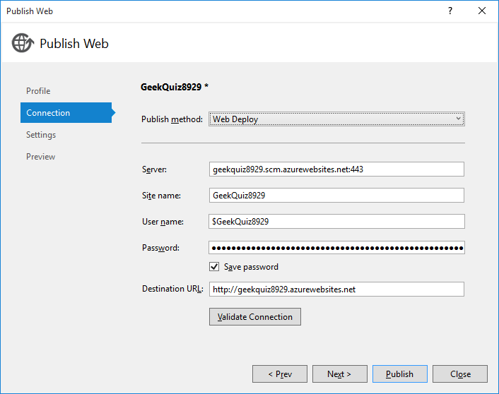

    _Publish Dialog - der Connection Tab_

3. Markieren Sie die Option **Enable Organizational Authentication**. Tragen Sie in das Feld **Domain** den Domain-Namen des AD Verzeichnisses ein. Markieren Sie die Option **Read directory data**. Beachten Sie, dass im Abschnitt **Databases** bereits der Connection String der Cloud Datenbank eingetragen ist. Sollte dies nicht der Fall sein, ermitteln Sie über das **Management Portal** den Connection String und tragen Sie ihn hier ein. Bestätigen Sie mit **Publish**.

    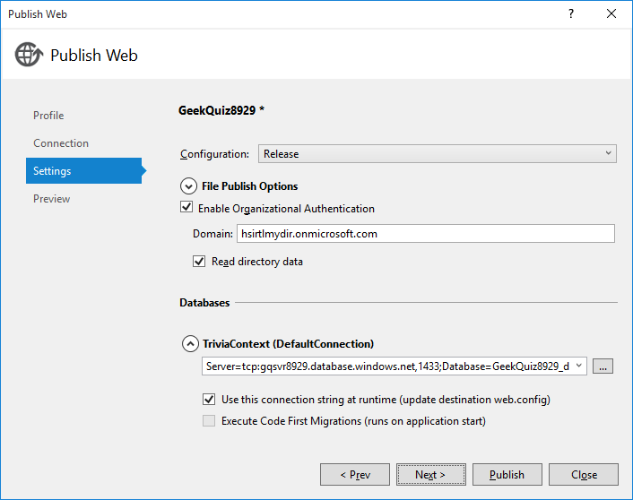

    _Publish Dialog - Settings Tab_

4. Visual Studio deployt daraufhin die Website. Nach Abschluss des Deployments erscheint ein Browser Fenster. Dieses fordert Sie zum Anmelden auf.

	Sobald Sie sich authentifiziert haben, werden Sie auf die Startseite der neu veröffentlichten Web App auf Azure geleitet.

    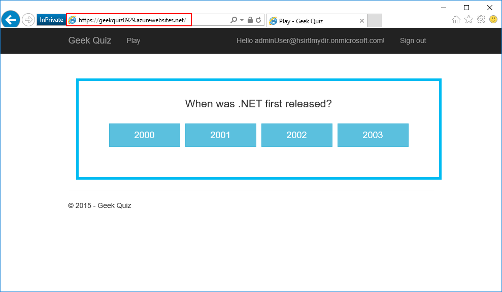

    _Geek Quiz auf Azure_

5. Falls Sie eine Fehlermeldung erhalten, ersetzen Sie den Code in der Datei _Views\Shared\\_LoginPartial.cshtml_ durch den folgenden Code und publizieren Sie das Projekt erneut.

	<!-- mark:1-8,15 -->
	```HTML
	@{
	   var user = "Null User";
	   if (!String.IsNullOrEmpty(User.Identity.Name))
	   {
	      user = User.Identity.Name;
	   }

	}

	@if (Request.IsAuthenticated)
	{
	    <text>
		 <ul class="nav navbar-nav navbar-right">
		    <li>
		       @Html.ActionLink(user, "UserProfile", "Home", routeValues: null, htmlAttributes: null)
		    </li>
		    <li>
			@Html.ActionLink("Sign out", "SignOut", "Account")
		    </li>
		</ul>
	    </text>
	}
	else
	{
	     <ul class="nav navbar-nav navbar-right">
		<li>@Html.ActionLink("Sign in", "Index", "Home", routeValues: null, htmlAttributes: new { id = "loginLink" })</li>
	    </ul>
	}
	```

	> **Note:** Wenn Sie nun die Anwendung neu starten und als Anwender "Null User" angezeigt wird, melden Sie sich ab und erneut mit dem Azure AD User wieder an.

<a name="cleanup"></a>
## Anhang

In dieser Übung lernen Sie, wie Sie die oben erstellten Ressourcen wieder löschen. Dies sind:

* die Web App
* der globale Account

Um die Web App zu löschen führen Sie folgende Schritte durch:

1. Rufen Sie im Browser [http://portal.azure.com](http://portal.azure.com) auf und melden Sie sich mit Ihrem Azure Account an.

2. Wählen Sie den Menüpunkt **Resource Groups**.

    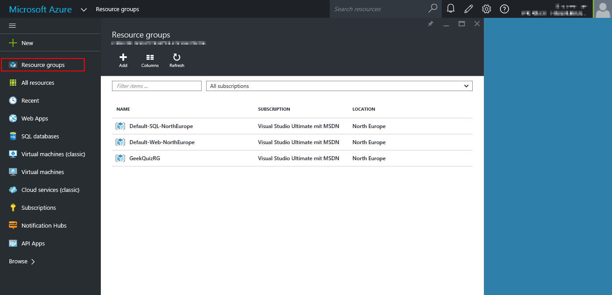

    _Anzeige der Resourcengruppen_

3. Wählen Sie die zuvor angelegte Resoucengruppe aus und wählen Sie **DELETE** in der Kommandozeile.

	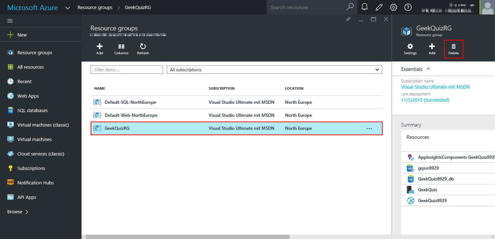

	_Löschen der Resourcengruppe_

4. Geben Sie im Bestätigungsdialog erneut den Namen der Ressourcengruppe ein und bestätigen Sie mit **Delete**.

Darüber hinaus können Sie über das Management-Portal ([http://manage.windowsazure.com](http://manage.windowsazure.com)) das Azure AD Verzeichnis löschen.

## Zusammenfassung

Nach Beendigung dieses Labs haben Sie folgendes gelernt:

* Erstellen eines globalen Account Administrators im Azure Active Directory
* Erstellen eines ASP.NET Web API Controllers via ASP.NET Scaffolding
* Die Graph API
* Implementierung einer Web API Get Action, um die nächste Quiz-Frage zu ermitteln
* Implementierung eienr Web API Post Action, um die Quiz-Antwort zu speichern
* Installation von AngularJS über die Visual Studio Package Manager Console
* Implementierung von AngularJS Templates und Controller
* Verwendung von CSS3 Transitions, um Animationseffekte einzubinden
* Deployment der Anwendung nach Microsoft Azure
