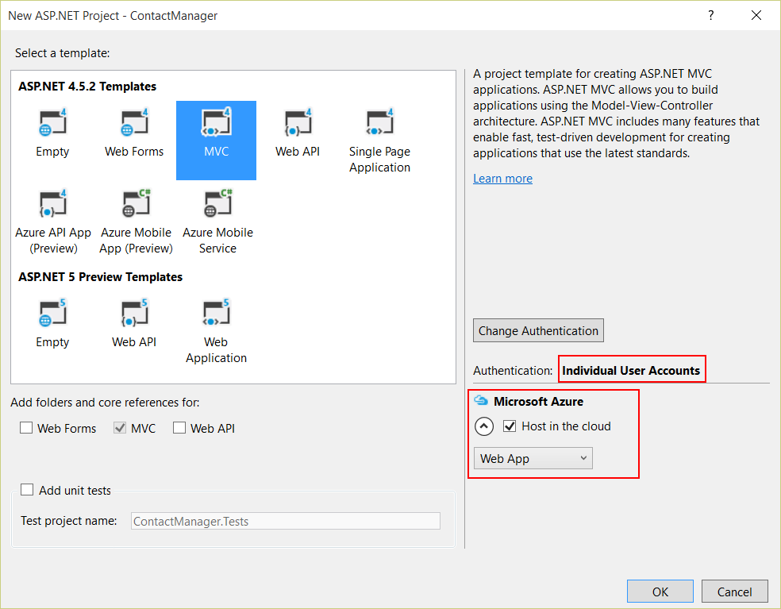

# Arbeiten mit Azure App Service Web Apps und ASP.NET

Dieses Lab führt durch das Erstellen einer ASP.NET Web Anwendung und die Veröffentlichung auf einer Azure Azure Service Web App mit Visual Studio 2015. Hierbei ist kein Vorwissen im Bereich Azure oder ASP.NET nötig. Am Ende des Labs werden Sie eine einfache Webanwendung in der Cloud betreiben.

Dieses Lab enthält die folgenden Abschnitte:

1. [Erstellen einer ASP.NET Web Anwendung in Visual Studio](#Task1)
1. [Veröffentlichen der Anwendung auf Azure](#Task2)
1. [Durchführen von Änderungen und Neuveröffentlichung](#Task3)
1. [Überwachen und Verwalten der Seite im Preview Portal](#Task4)
1. [Anhang - Aufräumen](#cleanup)

## Erstellen einer ASP.NET Web Anwendung in Visual Studio

In diesem Schritt werden Sie die Web Anwendung erstellen, die in diesem Lab verwendet wird.

1. Öffnen Sie Visual Studio. Aus dem **File** Menü, wählen Sie die **New** Option und klicken Sie **Project**.

	

    _New Project im File Menü_

2. Im **New Project** Dialog, erweitern Sie **Visual C#** und wählen Sie **Web** unter **Installed Templates**, wähnen Sie dann **ASP.NET Web Application** aus.

3. Nennen Sie die Anwendung **ContactManager** und klicken Sie auf **OK**.

	

    _New Project Dialog_

	>**Hinweis:** Stellen Sie sicher, dass Sie das Projekt "ContactManager" nennen. Code-Blöcke, die Sie später kopieren werden, gehen davon aus, dass der Name des Projekts ContactManager ist. 

4. Im **New ASP.NET Project** Dialog wählen Sie das **MVC** Template im Bereich ASP.NET 4.5. Stellen Sie sicher, dass **Authentication** auf **Individual User Accounts** gestellt ist, **Host in the cloud** markiert und **Web App** ausgewählt ist. Klicken Sie dann auf **OK**.

	

    _New ASP.NET Project Dialog_

5. Falls Sie sich noch nicht bei Microsoft Azure angemeldet haben, fordert Sie Visual Studio nun auf dies zu tun. Klicken Sie auf **Sign In**. Folgen Sie den Anweisungen und melden Sie sich mit Ihren Benutzerdaten an.

	

    _Anmelden bei Azure_

6. Wählen Sie einen Namen für die Bereitstellungs-URL aus, erstellen Sie einen neuen **App Service Plan**, eine neue **Resource Group** und wählen Sie eine Rechenzentrumsregion aus. Sie können [azurespeed.com](http://www.azurespeed.com/ "AzureSpeed.com") nutzen, um die Region mit den besten Antwortzeiten zu ermitteln.

7. Erstellen Sie zudem eine neue Datenbank, indem Sie nach Auswahl von **Create new server** Datenbankname, Benutzername und Passwort festlegen.

	

    _Configure Azure Web App_

	In der Regel ist es zu empfehlen für Test und Entwicklung mehrere Datenbanken auf dem gleichen Server anzulegen, statt für jede Datenbank einen neuen Server zu erstellen. Die Datenbank und Ihre Web App sollten sich in der gleichen Region befinden.
	
8. Klicken Sie dann auf **OK**.

	In a few seconds, Visual Studio creates the web project in the folder you specified, and it creates the Web App in the Azure region you specified.

	The **Solution Explorer** window shows the files and folders in the new project.

	

	_Solution Explorer_

	The **Azure App Service Activity** window shows that the Web App has been created.

	

	_Web App created_

	And you can see the Web App and database in **Server Explorer**.

	> **Note:** if the Server Explorer window is not open, you can open it from the **View** menu.

	

    _Web App created_

## Deploy the application to Azure

1. In the **Azure App Service Activity** window, click **Publish ContactManager to this Web App now**.

	

    _Azure App Service Activity Window_

	In a few seconds the **Publish Web** wizard appears.

	The settings that Visual Studio needs to deploy your project to Azure have been saved in a *publish profile*. The wizard enables you to review and change those settings.

2. In the **Connection** tab of the **Publish Web** wizard, click **Validate Connection** to make sure that Visual Studio can connect to Azure in order to deploy the web project.

	

    _Validating the connection_

	When the connection has been validated, a green check mark is shown next to the **Validate Connection** button.

3. Click **Next**.

	

	_Successfully validated connection_

4. The **Settings** tab is shown. If you expand **File Publish Options** you will see several settings that enable you to handle scenarios that don't apply to this lab:

	* **Remove additional files at destination**.

		Deletes any files at the server that aren't in your project. You might need this if you were deploying a project to a site that you had deployed a different project to earlier.

	* **Precompile during publishing**.

		Can reduce first-request warm up times for large sites.

	* **Exclude files from the App_Data folder**.

		For testing you sometimes have a SQL Server database file in App_Data which you don't want to deploy to production.

	In this case, keep the default values for **Configuration** and **File Publish Options** and click **Next**.

	

    _Settings tab_

5. In the **Preview** tab, click **Start Preview**.

	

	_Start Preview button - Preview tab_

	The tab displays a list of the files that will be copied to the server. Displaying the preview isn't required to publish the application but it's a useful function to be aware of.

6. Click **Publish**.

	

	_File Preview_

	Visual Studio begins the process of copying the files to the Azure server.

	The **Output** and **Azure App Service Activity** windows show what deployment actions were taken and report successful completion of the deployment.

	

    _Azure App Service Activity reporting successful deployment_

	

	  _Output Window reporting successful deployment_

	Upon successful deployment, the default browser automatically opens to the URL of the deployed Web App, and the application that you created is now running in the cloud. The URL in the browser address bar shows that the site is being loaded from the Internet.

	

	_Web App running in Azure_

7. Close the browser.

## Make a change and redeploy

In this task, you will change the **h1** heading of the home page, run the project locally on your development computer to verify the change, and then deploy the change to Azure.

1. Open the *Views/Home/Index.cshtml* file in **Solution Explorer**, change the **h1** heading from "ASP.NET" to "ASP.NET and Azure", and save the file.

	

    _Index.cshtml_

	

    _Changing the page's heading_

2. Press **CTRL+F5** to see the updated heading by running the site on your local computer.

	

	_Web App running locally_

	The **http://localhost** URL shows that it's running on your local computer. By default it's running in IIS Express, which is a lightweight version of IIS designed for use during web application development.

3. Close the browser.

4. In **Solution Explorer**, right-click the project, and choose **Publish**.

	

    _Preparing a new deployment_

	The Preview tab of the **Publish Web** wizard appears. If you needed to change any publish settings you could choose a different tab, but now all you want to do is redeploy with the same settings.

5. In the **Publish Web** wizard, click **Publish**.

	

	_Publish Web Wizard_

	Visual Studio deploys the project to Azure and opens the site in the default browser.

	

	_Changes deployed_

	>**Tip:** You can enable the **Web One Click Publish** toolbar for even quicker deployment. Click **View** > **Toolbars**, and then select **Web One Click Publish**. The toolbar enables you to select a profile, click a button to publish, or click a button to open the **Publish Web** wizard.

	

    _Web One Click Publish Toolbar_

## Monitor and manage the site in the preview portal

The [Azure Preview Portal](https://portal.azure.com/) is a web interface that enables you to manage and monitor your Azure services, such as the App Service Web App you just created. In this task you will look at some of what you can do in the portal.

1. In your browser, go to [http://portal.azure.com](http://portal.azure.com), and sign in with your Azure credentials.

	The portal displays the home dashboard.

	On the left, click on **Browse** and then scroll down until you find **Web Apps**. Click on **Web Apps**.

	

2. Click the name of your Web App on the blade.

	

    _Web Apps blade_

3. This blade gives you an overview of your Web App.

	You can access monitoring information, change the pricing tier, configure continuous deployment and various other tasks.

	

  	_Web App's overview blade_

	At this point your site hasn't had much traffic and may not show anything in the graph. If you browse to your application, refresh the page a few times, and then come back again, it will show up some traffic.

4. Click at **Settings** at the top of the blade. Then click **Application Settings**.

	The [Application Settings](http://azure.microsoft.com/en-us/documentation/articles/web-sites-configure/) blade enables you to control the .NET version used for the Web App, enable features such as [WebSockets](http://azure.microsoft.com/blog/2013/11/14/introduction-to-websockets-on-windows-azure-web-sites/) and [diagnostic logging](http://azure.microsoft.com/en-us/documentation/articles/web-sites-enable-diagnostic-log/), set [connection string values](http://azure.microsoft.com/blog/2013/07/17/windows-azure-web-sites-how-application-strings-and-connection-strings-work/), and more.

	

  	_WebApp's settings blade_

5. Click the **Scale** option, right below **Application Settings**.

	For the paid tiers of the Azure App Service, the [Scale](http://azure.microsoft.com/en-us/documentation/articles/web-sites-scale/) option enables you to control the size and number of machines that service your web application in order to handle variations in traffic.

	You can scale manually or configure criteria or schedules for automatic scaling.

	

    _Web App's Scale Options_

	These are just a few of the management portal features. You can also create new App Service apps, delete existing apps, stop and restart apps, and manage other kinds of Azure services, such as databases and virtual machines.

##Appendix - Cleanup

In this task you will learn how to delete the Web App published in the previous section.

1. In your browser, go to [http://portal.azure.com](http://portal.azure.com), and sign in with your Azure credentials.

2. Click on **Browse** and scroll down until you see **Web Apps**. Click on **Web Apps**.

3. Select your Web App. The Web App blade should now be open.

4. Click **Delete** in the top bar.

	

	_Clicking Delete to delete Web App_

5. In the **Delete app** confirmation dialog, click **Yes**.

	This will delete the Web App but it will keep the database intact. If you want to delete the database as well, follow the instructions below.

6. Click on **Browse** and scroll down until you see **SQL Databases**. Click on **SQL Databases**.

	
	_Click SQL databases_

7. In the new **SQL Databases** blade, click on your database.

	The database blade should now be open.

8. Click on **Delete** from the top bar.

	

9. In the **Delete database** confirmation dialog, click **Yes**.

## Summary

In this lab you have seen how to create a simple web application and deploy it to an Azure App Service Web App. You also made a quick tour around the Azure Preview Portal.
