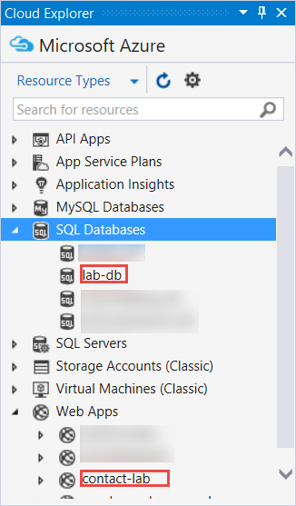
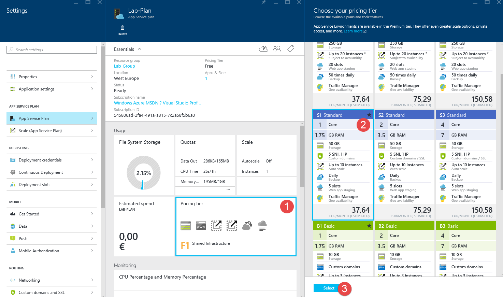

# Arbeiten mit Azure App Service Web Apps und ASP.NET

Dieses Lab führt durch das Erstellen einer ASP.NET Web Anwendung und die Veröffentlichung auf einer Azure Azure Service Web App mit Visual Studio 2015. Hierbei ist kein Vorwissen im Bereich Azure oder ASP.NET nötig. Am Ende des Labs werden Sie eine einfache Webanwendung in der Cloud betreiben.

Dieses Lab enthält die folgenden Abschnitte:

1. [Erstellen einer ASP.NET Web Anwendung in Visual Studio](#Task1)
1. [Veröffentlichen der Anwendung auf Azure](#Task2)
1. [Durchführen von Änderungen und Neuveröffentlichung](#Task3)
1. [Überwachen und Verwalten der Seite im Preview Portal](#Task4)
1. [Anhang - Aufräumen](#cleanup)

## Erstellen einer ASP.NET Web Anwendung in Visual Studio

In diesem Schritt werden Sie die Web Anwendung erstellen, die in diesem Lab verwendet wird.

1. Öffnen Sie Visual Studio. Aus dem **File** Menü, wählen Sie die **New** Option und klicken Sie **Project**.

	

    _New Project im File Menü_

2. Im **New Project** Dialog, erweitern Sie **Visual C#** und wählen Sie **Web** unter **Installed Templates**, wähnen Sie dann **ASP.NET Web Application** aus.

3. Nennen Sie die Anwendung **ContactManager** und klicken Sie auf **OK**.

	

    _New Project Dialog_

	>**Hinweis:** Stellen Sie sicher, dass Sie das Projekt "ContactManager" nennen. Code-Blöcke, die Sie später kopieren werden, gehen davon aus, dass der Name des Projekts ContactManager ist. 

4. Im **New ASP.NET Project** Dialog wählen Sie das **MVC** Template im Bereich ASP.NET 4.5. Stellen Sie sicher, dass **Authentication** auf **Individual User Accounts** gestellt ist, **Host in the cloud** markiert und **Web App** ausgewählt ist. Klicken Sie dann auf **OK**.

	

    _New ASP.NET Project Dialog_

5. Falls Sie sich noch nicht bei Microsoft Azure angemeldet haben, fordert Sie Visual Studio nun auf dies zu tun. Klicken Sie auf **Sign In**. Folgen Sie den Anweisungen und melden Sie sich mit Ihren Benutzerdaten an.

	

    _Anmelden bei Azure_

6. Wählen Sie einen Namen für die Bereitstellungs-URL aus, erstellen Sie einen neuen **App Service Plan**, eine neue **Resource Group** und wählen Sie eine Rechenzentrumsregion aus. Sie können [azurespeed.com](http://www.azurespeed.com/ "AzureSpeed.com") nutzen, um die Region mit den besten Antwortzeiten zu ermitteln.

7. Erstellen Sie zudem eine neue Datenbank, indem Sie nach Auswahl von **Create new server** Datenbankname, Benutzername und Passwort festlegen.

	

    _Configure Azure Web App_

	In der Regel ist es zu empfehlen für Test und Entwicklung mehrere Datenbanken auf dem gleichen Server anzulegen, statt für jede Datenbank einen neuen Server zu erstellen. Die Datenbank und Ihre Web App sollten sich in der gleichen Region befinden.
	
8. Klicken Sie dann auf **OK**.

	In wenigen Sekunden erzeugt Visual Studio ein Web Projekt in gewählen Ordner. Es wird außerdem eine Azure Web in der gewählten Region erstellt.
	
	Der **Solution Explorer** zeigt nun die Dateien und Ordner im neuen Projekt.

	

	_Solution Explorer_

	Das **Azure App Service Activity** Fenster zeigt, dass die Web App erstellt wurde.

	

	_Web App erstellt

	Sie können die Web App nun auch im **Cloud Explorer" sehen.

	> **Hinweis:** Wenn der Cloud-Explorer nicht angezeigt wird, können Sie ihn über das **View** Menü einblenden.

	

    _Web App im Cloud Explorer_

## Veröffentlichen der Anwendung auf Azure

1. Im **Azure App Service Activity** Fenster, klickek Sie auf **Publish ContactManager to this Web App now**. Falls diese Schaltfläche nicht angezeigt wird, können Sie auch mit der Rechten Maustaste auf das Projekt im **Solution Explorer** klickt und dann auf den Punkt **Publish**.

	

    _Azure App Service Activity Fenster

	Innerhalb von wenigen Sekunden erscheint der **Publish Web** Dialog.
	
	Die Einstellungen, welche Visual Studio für einen Veröffentlung des Projektes benötigt, wurden in einem *Publish Profile* gespeichert. In diesem Dialog können wir nun die diese Einstellungen prüfen. Klicken Sie dafür auf **Next**.

2. In der Registerkarte **Connection** des **Publish Web** Dialogs, können Sie nun auf **Validate Connection** klicken, um sicher zu gehen, dass Visual Studio sich zu Azure verbinden kann.

	

    _Prüfen der Verbindung_

	Wenn die Verbindung erfolgreich geprüft wurden, wird ein grüner Haken angezeigt.
	
3. Klicken Sie nun auf **Next**.

	

	_Die Verbindung wurde erfolgreich geprüft_

4. Nun wird die Registerkarte **Settings** angezeigt. Wenn Sie nun **File Publish Options** erweitern, sehen Sie weitere Einstellungsmöglichkeiten. Diese sind jedoch für dieses Lab nicht relevant.

	* **Remove additional files at destination**.

		Löscht Dateien auf dem Server, die nicht in Ihrem Projekt sind. Sie könnten diese Einstellunge benötigen, wenn Sie ein Projekt auf eine Seite veröffentlichen, die Sie zuvor für ein anderen Projekt benutzt haben.

	* **Precompile during publishing**.

		Kann die Startzeit beim ersten Request für große Seiten verkürzen.

	* **Exclude files from the App_Data folder**.

		Zum Testen wird manchmal eine SQL Server Datenbankdatei im Ordner App_Data verwendet, welche nicht in die Produktionsumgebung kopiert werden soll.

	In disem Fall belassen wir es bei den Standardwerten für **Configuration** and **File Publish Options** und klicken auf **Next**.

	

    _Registerkarte Settings_

5. Klicken Sie in der Registerkarte **Preview** auf **Start Preview**.

	

	_Start Preview Button_

	Die Registerkarte zeigt eine Liste der Deteien an, welche auf den Server kopiert werden. Ein Anzeigen der Preview ist für das veröffentlichen einer Anwendung auf Azure nicht zwingend erforderlich.

6. Klicken Sie auf **Publish**.

	

	_Dateivorschau_

	Visual Studio beginnt nun damit die Dateien auf den Azure Server zu kopieren.

	Das **Output** und **Azure App Service Activity** Fenster zeigt welche Schritte der Veröffentlichung gerade durchlaufen werden und zeigt nach erfolgreicher Veröffentlichung eine Benachrichtigung an.

	

    _Azure App Service Activity nach erfolgreicher Veröffentlichung_

	

	  _Output Window nach erfolgreicher Veröffentlichung_

	Nach der erfolgreichen Veröffentlichung, öffnet der eingestellte Standardbrowser die URL der veröffentlichten Web App. Die gerade erstellte Anwendung läuft nun in der Cloud. Die URL in der Browser-Adresszeile zeigt, dass die Seite aus dem Internet geladen wird.
	
	

	_Die Web App läuft in Azure_

7. Schließen Sie den Browser.

## Durchführung von Änderungen und Neuveröffentlichung

In dieser Aufgabe werden wir **h1** Überschrift der Home Page ändern, das Projekt lokal auführen, um die Änderungen zu überprüfen und die Änderung dann auf Azure veröffentlichen.

1. Öffnen Sie die *Views/Home/Index.cshtml* Datei im **Solution Explorer**, ändern Sie die **h1** Überschrift von "ASP.NET" in "ASP.NET and Azure" und speichern Sie die Datei.

	

    _Index.cshtml_

	

    _Ändern der Überschrift_

2. Drücken Sie **CTRL+F5**, um die akualisierte Überschrift auf der lokal ausgeführten Seite zu sehen.

	

	_Lokal ausgeführte Web App_

	Die **http://localhost** URL zeigt, dass die Seite auf dem lokalen Computer ausgeführt wird. Im Standardfall läuft sie im IIS Express, der eine leichtgewichtige Version des IIS für die Webentwicklung darstellt.

3. Schließen Sie den Browser.

4. Klicken Sie mit der rechten Maustaste im **Solution Explorer**, auf das Projekt und wählen Sie **Publish**.

	

    _Vorbereitung einer neuen Veröffentlichung_

	Nun erscheint die Registerkarte Preview des **Publish Web** Dialogs. Wenn Sie auf einer anderen Registerkarte eine Änderung vornehmen müssen, können Sie nun auf diese wechseln. Wir möchten aber an dieser Stelle mit den gleichen Einstellungen die Webanwendung erneut veröffentlichen.
	
5. Klicken Sie im **Publish Web** auf **Publish**.

	

	_Publish Web Dialog_

	Visual Studio veröffentlicht das Projekt auf Azure und öffnet die Seite im Standardbrowser.

	

	_Die Änderungen wurden veröffentlicht_

	>**Tipp:** Sie können die *Web One Click Publish** toolbar für schnelleres Deployment aktivieren. Klicken Sie auf **View** > **Toolbars** und wählen Sie **Web One Click Publish** aus. Die Toolbar ermöglicht es Ihnen ein Profil zu wählen, mit einem Klick zu veröffentlichen und desn **Publish Web** Dialog zu öffnen.

	

    _Web One Click Publish Toolbar_

## Überwachen und Verwalten der Seite im Preview Portal

Das [Azure Preview Portal](https://portal.azure.com/) ist ein Webinterface, mit welchem Sie Ihre Azure Services verwalten und überwachen können. In diesem Schritt werden wir uns ein paar der Funktionen des Portals ansehen.

1. Wechseln Sie im Browser auf [http://portal.azure.com](http://portal.azure.com) und melden Sie sich mit Ihren Microsoft Azure Benutzerdaten an.

	Das Portal zeigt nun das Dashboard an.
	
	Klicken Sie auf der linken Seite auf **Browse** und gehen Sie ganz nach Unten, wo Sie **Web Apps** finden. Klicken Sie auf **Web Apps**.

	

2. Klicken Sie auf den Namen Ihrer Web App.

	

    _Web Apps Blade

3. Diese Seite gibt Ihnen einen Überblick über Ihre Web App.

	Sie können nun auf Monitoring-Informationen zugreifen, die Preisstufe ändern, Continuous Deployment einrichten und einige andere Dinge einstellen.
	
	

  	_Web App Überblicksseite_

	Zu diesem Zeitpunkt hat Ihre Seite noch nicht viel Traffic, enthält der Graph kaum Informationen. Wenn Sie Ihre Anwendung besuchen bzw. die Seite aktualisieren, sollte Sie an dieser Stelle Traffic sehen.

4. Klicken Sie nun auf **Settings** im oberen Bereich der Seite. Dann auf **Application Settings**.

	Die [Application Settings](http://azure.microsoft.com/en-us/documentation/articles/web-sites-configure/) Seite ermöglicht es die .Net Version zu steuern, zusätzliche Funktionen wie [WebSockets](http://azure.microsoft.com/blog/2013/11/14/introduction-to-websockets-on-windows-azure-web-sites/), [Diagnostic Logging](http://azure.microsoft.com/en-us/documentation/articles/web-sites-enable-diagnostic-log/) zu aktivieren, die Werte der [Connection String](http://azure.microsoft.com/blog/2013/07/17/windows-azure-web-sites-how-application-strings-and-connection-strings-work/) zu setzen und vieles mehr.

	

  	_WebApp Einstellungsseite_
	  
5. Klicken Sie auf **App Service Plan** und dort auf die Schaltfäche **Pricing Tier**. Wählen Sie dort die Stufe S1 Standard, um Ihre Web App auf mehrer Instanzen skalieren zu können.

	Hier haben Sie möglichkeiten die Preisstufe bzw. Leistungsstufe für den App Service Plan zu wechseln, in welchem Ihre Web App ausgeführt wird. Von einem Wechsel der Leistungsstufe sind alle in diesem App Service Plan betriebenen Web Apps, API-Apps, Logic Apps und Mobile Apps betroffen.
	
	
	
	_App Service Plan Pricing Tier_

6. Klicken Sie nun auf die **Scale** Option im Bereich **App Service Plan**.

	Für die kostenpflichtigen Stufen eines Azure App Service ermöglicht es die [Scale](http://azure.microsoft.com/en-us/documentation/articles/web-sites-scale/)-Option die Anzahl der Maschinen, die Ihre Web Anwendung ausliefern, bei sich änderndem Traffic anzupassen.

	Sie können manuell, gemäß festgelegter Kriterien oder nach Zeitplänen skalieren.

	

    _Web App Skalierungsmöglichkeiten_
	
	Dies sind nur einige wenige Funktionen des Management Portals. Sie können außerdem existierende Apps löschen, stoppen und neu starten, sowie alle anderen Azure Dienste verwalten.

##Anhang - Aufräumen

In diesem Schritt werden wir die gerade angelegte Web App wieder löschen und im Portal wieder aufräumen.

1. Wechseln Sie im Browser auf [http://portal.azure.com](http://portal.azure.com) und melden Sie sich mit Ihren Azure Benutzerdaten an.

2. Klicken Sie nun auf **Browse** und wählen Sie **Web Apps** aus.

3. Wählen Sie nun Ihre Web App.

4. Klicken Sie auf **Delete** in der oberen Leiste.

	

	_Klicken auf "Delete" zum löschen der Web App_

5. Bestätigen Sie das Löschen im **Delete app** Dialog mit **Yes**.

	Dies wird Ihre Web App löschen. Ihre Datenbank ist jedoch noch intakt. Falls Sie Ihre Datenbank löschen wollen, folgen Sie den nächsten Anweisungen.

6. Klicken Sie auf **Browse** und wählen Sie **SQL Databases**.

7. Wählen Sie Ihre **SQL Databases** aus.

	Die Übersichtsseite für Ihre Datenbank sollte nun geöffnet werden.

8. Klicken Sie nun auf **Delete** in der oberen Leiste.

	

9. Bestätigen Sie die RÜckfrage mit einem Klick auf **Yes**.

## Zusammenfassung

In diesem Lab haben Sie gesehen, wie eine einfache Web Anwendung angelegt und auf eine Azure App Service Web App veröffentlicht wird. Wir haben uns zudem das Preview Portal etwas näher angesehen.
