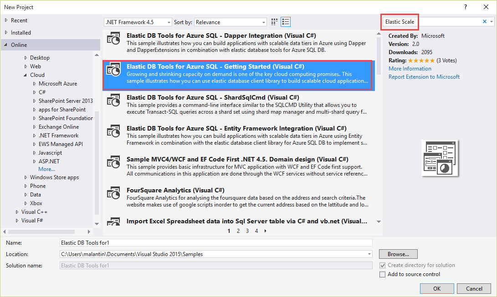
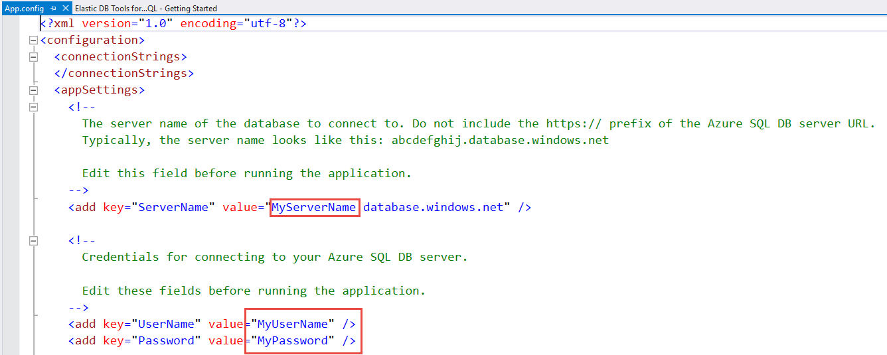

Schnellstart in die Nutzung Azure SQL Database Elastic Scale
=======================================================================================

Wachsenden und schrumpfende Kapazitäten, welche sich am tatsächlichen Bedarf orientieren, sind eines der Kernversprechen von Cloud Computing. Diesem Versprechen gerecht zu werden war in der Vergangheit für die Datenbankschicht von Cloud Anwendugnen jedoch oft mühsam und komplex. Über die letzten Jahre hat sich in der Industrie hierfür ein Entwurfsmuster etabliert, welches als "Sharding* bekannt ist. Obwohl das allgemeine Sharding-Entwurfsmuster viele der Herausforderungen löst, sind für die Entwicklung und den Betrieb von Anwendungen die dieses nutzen, unabhängig von der Business Logic immer noch nennenswerte Investitionen in die Infrastruktur nötig.

Azure SQL Database Elastic Scale ermöglicht es der Datenschicht einer Anwendung, auf Basis von in der Industrie etablierten Vorgehensweisen für das Sharding, zu skalieren und zugleich die Entwicklung und das Management von Cloud-Anwendungen zu optimieren. Elastic Scale bietet Funktionalitäten für Entwicklung und Management über .Net Bibliotheken sowie Vorlagen für Azure Dienste, die Sie in Ihrer eigenen Azure Subscription betreiben können, um Ihre hochskalierbaren Anwendungen zu verwalten. Azure Database Elastic Scale setzt die Infrastrukturaspekte von Sharding um und erlaubt es Ihnen somit, sich auf die Geschäftslogik Ihrer Anwendung zu konzentrieren.  

In diesem Lab werden Sie die Entwicklerseite von Azure SQL Database Elastic Scale näher kennenlernen.

Dieses Lab enthält die folgende Aufgaben:

* [Erstellen eines Microsoft Azure SQL Database Servers](#Task1)
* [Durchlaufen des Beispiels](#Task2)
* [Anhang - Aufräumen](#cleanup)

## Erstellen eines Microsoft Azure SQL Database Servers ##

In dieser Aufgabe werden Sie einen neuen Microsoft Azure SQL Database Server erstellen und die Firewall so konfigurieren, dass Verbindungen von auf dem lokalen Computer ausgeführten Anwendungen Zugriff auf die Datenbanken in Ihrem SQL Database Server haben.

1. Melden Sie sich am [Management Portal](http://manage.windowsazure.com) an.

1. Klicken Sie im seitlichen Menü auf **SQL DATABASES**. Klicken Sie dann auf die Registerkarte **SERVERS**. 

	

	_Navigation zur Registerkarte SQL Database Server_

1. Klicken Sie auf **ADD** in der unteren Leiste, um einen neuen SQL Database Server anzulegen.

	

	_Hinzufügen eines neuen SQL Database Servers_

1. Setzen Sie im **CREATE SERVER** Dialogfenster die Servereinstellungen wie folgt:

	* **Login Name**: Geben Sie den Adminstratornamen als ein Wort ohne Leerzeichen an. SQL Database verwendet SQL Authentifizierung über eine verschlüsselte Verbindung, um den Benutzer zu validieren. Ein neuer SQL Server Authentifizierungs-Login mit Administratorrechten wird mit dem von Ihnen definierten Namen erstellt. Der Administratorname kann kein Windows Benutzer oder Live ID / Microsoft Account sein. Windows Authetifizierung wird von SQL Database nicht unterstützt.
	
	* **Login Password**: Verwenden Sie ein Passwort mit mindestens 8 Zeichen, mit einer Kombination aus Groß- und Kleinbuchstaben und einer Zahl bzw. Sonderzeichen. Verwenden Sie die Hilfe-Schaltfäche **?** für mehr Informationen zu Passwortkomplexität.

	* **Region**: Wählen Sie eine Region. Die Region bestimmt die geographische Position Ihres Servers. Regionen können im laufenden Betrieb nicht einfach gewechselt werden, stellen Sie daher sicher die Region zu wählen, welche für Ihre Zwecke am besten geeignet ist. Der Betrieb der eigenen Azure Anwendung und der Datenbank in der gleiche Region hilft dabei die Latenz zu verringern und Kosten für ausgehenden Datentransfer zu reduzieren.
	
	* Stellen Sie sicher, dass **Allow Azure Services to access this server** ausgewählt ist, damit Dienste wie Azure SQL Reporting auf die Datenbank zugreifen können.

	Klicken Sie letztenendes auf den Haken im unteren Teil des Dialogs, um den Server zu erstellen.

	Beachten Sie, dass Sie keinen Servernamen definiert haben. Da der Server weltweit zugreifbar sein soll, konfiguriert SQL Database den entsprechenden DNS-Eintrag, wenn der Server erstellt wird. Der generierte Name stellt sicher, dass es keine Namenskonflikte mit anderen DNS-Einträgen gibt. Sie können den Namen Ihres SQL Database Servers nicht ändern.
	
	

	_Erstellen eines neuen SQL Database Server_

1. Warten Sie bis der Server erstellt wurde. Sie werden dann einen Hinweis sehen und es wird eine Eintrag auf der **SQL databases** Seite hinzugefügt.

	

	_SQL Database Server erstellt_

	Nun werden Sie die Firewall so konfigurieren, dass Sie Verbindungen von Anwendungen auf dem lokalen Computer einen Zugriff auf die Datenbanken auf Ihrem SQL Database Server erlaubt.
	
	Um die Firewall so zu konfigurieren, dass Verbindungen erlaubt werden, werden Sie Informationen auf der Server Seite eingeben.
	
	> **Hinweis:** Der SQL Database Dienst ist nur über TCP port 1433 verfügbar, welcher vom TDS Protokoll verwendet wird. Stellen Sie daher sicher, dass die Firewall Ihres Netzwerks sowie der lokale Computer ausgehende Verbindungen auf Port 1433 erlaubt. Für mehre Details schauen Sie in die Informationen zur [SQL Database Firewall](http://social.technet.microsoft.com/wiki/contents/articles/2677.sql-azure-firewall-en-us.aspx).

1. Klicken Sie auf den Server den Sie gerade erstellt haben, um die Serverseite zu öffnen.

	

	_Navigation zum neuen Server_

1. Klicken Sie auf der Serverseite nun auf **Configure** um die **Allowed IP Addresses**-Einstellungen anzuzeigen. Klicken Sie dann auf den **Add to the allowed IP Addresses** Link. 

	Dies wird eine neue Firewall-Regel erzeugen, die Verbindungen erlaubt, die vom Router oder Proxy Server kommen, über den Sie verbunden sind.

	

	_Hinzufügen einer Firewall-Regel für den Server_

	> **Hinweis:** Sie können zusätzliche Firewall-Regeln erzeugen, indem Sie einen Namen sowie einen IP-Bereich definieren.

1. Um die Änderungen zu speichern, klicken Sie auf **SAVE** am unteren Rand der Seite.

	

	_Speichern der Änderungen an die erlaubten IP-Adressen_

1. Merken oder Notieren Sie sich den Namen des SQL Database Servers (z.B.: _z754axd2q8_), da Sie diesen im folgenden Schritt benötigen.

Sie haben nun einen SQL Database Server auf Azure, eine Firewall-Regel die den Zugriff auf den Server erlaubt und einen Administrator-Login.

## Durchlaufen des Beispiels ##

Die **Elastic Scale with Azure SQL Database - Getting Started** Beispielanwendung zeigt die wichtigstens Aspekte der Entwicklung von Anwendungen welche Sharding und Azure SQL DB Elastic Scale nutzen. Es konzentriert sich auf die Haupteinsatzzwecke von [Shard Map Management](http://go.microsoft.com/?linkid=9862595), [Data Dependent Routing](http://go.microsoft.com/?linkid=9862596) und [Multi-Shard Querying](http://go.microsoft.com/?linkid=9862597). 

Die werden nun das Beispiel herunterlagen, konfigurieren und ausführen. 

1. Öffnen Sie Visual Studio und wählen Sie **File -> New -> Project**.

	

	_Anlegen eines neuen Projektes_

1. Klicken Sie im _New Project_ Dialog auf **Online**.

	

	_Wählen von Online_

1. Nun klicken Sie auf **Visual C#** unter **Samples**.

	

	_Wechseln zu Online C# Samples_

1. Tippen Sie **Elastic Scale** in die Suchmaske, um das Beispiel zu suchen. **Elastic DB Tools for Azure SQL - Getting Started** erscheint.
 
1. Wählen Sie das Beispiel aus, legen Sie einen Namen und einen Speicherort für das Projekt fest und klicken Sie auf **OK**, um das Projekt zu erstellen.

	

	_Erstellen des Beispielprojekts_

1. Falls der **Download and Install** Dialog erscheint, klicken Sie auf **Install**.

	

	_Klicke auf Install im Download and Install Dialog_

1. Öffnen Sie die **App.config** Datei in der Solution und ersetzen Sie _MyServerName_ mit dem Namen Ihres Azure SQL Database Servers und _MyUserName_ sowie _MyPassword_ mit Ihren Anmeldeinformationen (Benutzername und Passwort).

	

	_Konfigurieren des Beispielprojekts_

1. Erstellen und Starten Sie die Anwendung. Wenn Sie gefragt werden, bestätigen Sie das wiederherstellen von NuGet Packeten in der Solution. Dies wird die neueste Version der Elastic Scale Client-Bibliotheken von NuGet herunterladen.

	

	_Ausführen des Beispiels_

1. Tippen Sie **1** in der Anwendung und drücken Sie **_Enter_**, um den Shard Map Manager und mehrere Shards zu erzeugen.

	> **Hinweis:** Der Code in Datei **ShardMapManagerSample.cs** zeigt, wie Sie mit Shards, Ranges, Mappings arbeiten. Mehr zu diesem Thema finden Sie hier: [Shard Map Management](http://go.microsoft.com/?linkid=9862595).

	Die Ausgabe wird so aussehen:

	

	_Erzeugen des Shard Map Managers und hinzufügen mehrerer Shards_

1. Wechseln Sie ins [Management Portal](http://manage.windowsazure.com) und dort in auf die SQL Database Server Seite. Klicken Sie hier auf die Registerkarte Datenbanken.

	Dort sehen Sie, dass Sie nun 3 Datenbanken haben. Den Shard Manager und eine für jeden Shard.
	
	

	_Wechseln auf die SQL Database Server Seite_

1. Gehen Sie zurück in die Anwendung, tippen Sie **3** und drück Sie **_Enter_**. Dies wird eien Beispielzeile mit Hilfe von Data-Dependent Routing einfügen.

	> **Hinweis:** Die Vermittlung von Transaktionen auf den korrekten Shard wird in der Datei **DataDependentRoutingSample.cs** gezeigt. Für mehr Details, lesen Sie bitte [Data Dependent Routing](http://go.microsoft.com/?linkid=9862596). 

	

	_Einfügen eine Beispielzeile_

1. Wiederholen Sie den letzten Schritt mindestens 3 mal, sodass sie mindestens vier Zeilen haben.

1. Geben Sie jetzt **4** ein und drücken Sie **_Enter_**. Hiermit führen Sie eine Multi-Shard Abfrage durch.

	Beachten Sie die _$ShardName_ Spalte. Sie zeigt, dass sich Zeilen mit _CustomerId_ von 0 bis 99 in _ElasticScaleStarterKit_Shard0_ befinden und die mit _CustomerId_ from 100 bis 199 in _ElasticScaleStarterKit_Shard1_.

	> **Hinweis:** Abfragen über Shards hinweg werden in der Datei **MultiShardQuerySample.cs** gezeigt. Für weitere Informationen sehen Sie sich [Multi-Shard Querying](http://go.microsoft.com/?linkid=9862597) an.

	

	_Ausführen einer Multi-Shard Abfrage_

1. Tippen Sie nun **2** ein und drücken Sie **_Enter_** in der Anwendung, um einen weiteren Shard hinzuzufügen. Wenn Sie nach einem höheren Schlüssel für den neuen Bereich gefragt werden, drücken Sie **_Enter_**, um den Standardwert _300_ zu wählen.

	> **Hinweis:** Das iterative hinzufügen von Shards wird durch den Coide in
 **AddNewShardsSample.cs** durchgeführt. Für mehr Informationen sehen Sie sich [Shard Map Management](http://go.microsoft.com/?linkid=9862595) an.

	

	_Hinzufügen eines neuen Shard_

1. Wechseln Sie zurück ins **Management Portal**. Sie sollten hier nun eine neue Datenbank für den neuen Shard mit dem Namen _ElasticScaleStarterKit_Shard2_ sehen.

	

	_Die neue Datenbank im Portal_

1. Wechseln Sie wieder in die Anwendung, tippen Sie **5** und drücken Sie **_Enter_**. Dies wird alle Shards und die Map Manager Datanbank verwerfen.

	

	_Entfernen der Shards und des Map Manager_

1. Stoppen Sie das Debugging.

Sie haben nun erfolgreich Ihre erste Elastic Scale Application auf Azure SQl Database erstellen und ausgeführt. Sie können mehr Informationen über Elastic Scale Operationen unter den folgenden Links finden:

* **Teilung eines existierenden Shards**: Die Fähigkeit Shards zu teilen wird duch den **Split/Merge service** bereitgestellt. Mehr Informationen finden Sie hier: [Split/Merge Service](http://go.microsoft.com/?linkid=9862795).

* **Zusammenführen existirender Shards**: Zusammenführungen von Shards wird auch durch den **Split/Merge service** ermöglicht. Mehr Informationen finden Sie hier: [Split/Merge Service](http://go.microsoft.com/?linkid=9862795). 

##Anhang - Aufräumen

In diesem Schritt werden Sie den SQL Database Server löschen, welchen wir im ersten Schritt angelegt haben.

1. Melden Sie sich am [Management Portal](http://manage.windowsazure.com) an.

1. Klicken Sie auf der seitlichen Leiste auf **SQL DATABASES**. Wählen Sie dann die Registerkarte **SERVERS**. 

1. Klicken Sie auf die Reihe mit dem Server, den Sie zuvor erstellt haben. Klicken Sie dann auf **DELETE** in der unteren Leiste.

1. Im Bestätigungsdialog müssen Sie noch einmal den Servernamen angeben und auf den Haken klicken.

_Bestätigung des Löschens_

Der Server wird nun gelöscht. Sobald dies erledigt ist, werden Sie einen Hinweis in der unteren Leiste sehen.

##Zusammenfassung

In diesem Lab haben Sie die wesentlichen Konzepte von Azure SQL Database Elastic Scale kennengelernt: Shard Map Management, Data Dependent Routing und Multi-Shard Querying.
